# Gas Pro — UI Prototype

## Giới thiệu
Bộ giao diện mô phỏng (Interactive Prototype) cho Hệ thống Quản lý Bán Gas & Thiết bị Hộ Kinh doanh.

## Công nghệ
- HTML5 + Tailwind CSS (CDN)
- Lucide Icons (CDN)
- Chart.js (CDN) — Biểu đồ
- Vanilla JavaScript

## Cách chạy
1. Mở file `index.html` trực tiếp trên trình duyệt (Chrome/Edge khuyến nghị)
2. Hoặc dùng VS Code Live Server extension
3. Hoặc chạy: `npx serve .` trong thư mục UI_Prototype

## Tài khoản Demo
- SĐT: 0901234567
- Mật khẩu: 123456
- Sau khi đăng nhập, chọn vai trò: Admin / Operator / Driver / Customer

## Sơ đồ Liên kết Trang

```mermaid
flowchart TD
    LOGIN[index.html - Đăng nhập] --> ROLE{Chọn vai trò}
    LOGIN --> REG[customer_register.html]
    REG --> LOGIN
    
    ROLE --> ADMIN[Admin Portal]
    ROLE --> OP[Operator Portal]
    ROLE --> DRV[Driver Portal]
    ROLE --> CUST[Customer Portal]
    
    ADMIN --> AD[admin_dashboard.html]
    ADMIN --> AP[admin_products.html]
    ADMIN --> AC[admin_customers.html]
    ADMIN --> ADR[admin_drivers.html]
    ADMIN --> AS[admin_suppliers.html]
    ADMIN --> AST[admin_settings.html]
    
    OP --> OO[operator_orders.html]
    OP --> OR[operator_reconciliation.html]
    OP --> OW[operator_warranty.html]
    OP --> OI[operator_inventory.html]
    
    DRV --> DJ[driver_jobboard.html]
    DRV --> DD[driver_delivery.html]
    DRV --> DR[driver_reconciliation.html]
    DRV --> DW[driver_warranty.html]
    
    CUST --> CC[customer_catalog.html]
    CUST --> CCA[customer_cart.html]
    CUST --> CO[customer_orders.html]
    CUST --> CW[customer_warranty.html]
```

## Danh sách File

| File | Mô tả | User Flow |
|---|---|---|
| index.html | Đăng nhập & Chọn vai trò | UM-002 |
| customer_register.html | Đăng ký tài khoản | UM-001 |
| admin_dashboard.html | Dashboard Admin + Báo cáo | BI-001, BI-002, CI-003, CD-004 |
| admin_products.html | Quản lý Sản phẩm & Giá | CO-004 |
| admin_customers.html | Khách hàng & Công nợ | UM-003, CD-001, CD-002 |
| admin_drivers.html | Tài xế & Hiệu suất | BI-003 |
| admin_suppliers.html | Công nợ NSX | CD-005 |
| admin_settings.html | Cấu hình Hệ thống | - |
| operator_orders.html | Quản lý Đơn hàng | OP-001, OP-002, SD-004, SD-005 |
| operator_reconciliation.html | Đối soát Cuối ca | RC-001, RC-003, RC-004 |
| operator_warranty.html | Bảo hành & Đổi trả | WR-004, WR-006 |
| operator_inventory.html | Tồn kho & Đối lưu NSX | CI-001, CI-002 |
| driver_jobboard.html | Chợ Đơn hàng | SD-001, SD-002 |
| driver_delivery.html | Đang Giao hàng | SD-003, CD-003 |
| driver_reconciliation.html | Nộp tiền & Quyết toán | RC-002, RC-005 |
| driver_warranty.html | Bảo hành & Sửa chữa | WR-002, WR-003, WR-005 |
| customer_catalog.html | Danh mục Sản phẩm | CO-001 |
| customer_cart.html | Giỏ hàng & Thanh toán | CO-002, CO-003 |
| customer_orders.html | Đơn hàng Của tôi | CO-005 |
| customer_warranty.html | Bảo hành Sản phẩm | WR-001, WR-005 |

## Lưu ý
- Đây là prototype mô phỏng, không kết nối backend thật
- Dữ liệu hiển thị là mock data cố định
- Tất cả tương tác (Modal, Toast, Form) đều hoạt động
- Sử dụng localStorage để lưu vai trò đăng nhập
