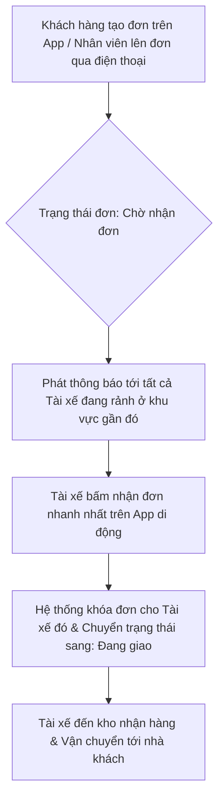

  # TÀI LIỆU YÊU CẦU NGHIỆP VỤ (BUSINESS REQUIREMENTS DOCUMENT - BRD)
## DỰ ÁN: HỆ THỐNG QUẢN LÝ BÁN GAS & THIẾT BỊ HỘ KINH DOANH
**Vai trò phân tích:** Senior Business Analyst (dựa trên quy chuẩn [business-analyst.md](file:///d:/6rd_semester/gas_management/rule_agent/business-analyst.md))  
**Phiên bản:** 1.0 (Discovery Phase Summary)  
**Ngày lập:** 31-07-2026

---

## 1. TỔNG QUAN DỰ ÁN & MỤC TIÊU CHIẾN LƯỢC
Hệ thống được xây dựng nhằm chuyển đổi số mô hình vận hành của một đại lý gas lớn (nhập hàng trực tiếp từ nhà sản xuất và phân phối tới hộ gia đình B2C, nhà hàng/xí nghiệp B2B).
* **Mục tiêu cốt lõi:**
  * Minh bạch hóa dòng tiền thực tế thông qua việc đối chiếu tự động đơn hàng của tài xế cuối ngày.
  * Tối ưu hóa vận hành giao hàng bằng thuật toán "giật đơn" tự động (phương án C).
  * Quản lý chặt chẽ công nợ (khách hàng lẻ/sỉ và công nợ với nhà sản xuất).
  * Kiểm soát vòng đời vỏ bình gas và tiền đặt cọc vỏ bình của khách hàng.
  * Xây dựng giao diện đặt hàng tiện lợi cho khách hàng cuối (tương tự Shopee).
  * Thu thập dữ liệu kinh doanh phục vụ báo cáo thống kê, hỗ trợ chủ đại lý đưa ra các quyết định chiến lược.

---

## 2. PHÂN QUYỀN VAI TRÒ TRÊN HỆ THỐNG (STAKEHOLDERS & ROLES)

Hệ thống phân chia thành 4 nhóm đối tượng người dùng chính với các quyền truy cập riêng biệt:

| Vai trò | Giao diện | Quyền hạn & Chức năng chính |
| :--- | :--- | :--- |
| **Admin (Chủ đại lý)** | Web Portal (Desktop) | Toàn quyền hệ thống. Xem báo cáo doanh thu tài chính, dòng tiền, giá vốn nhập hàng; quản lý danh mục sản phẩm, cấu hình công thức tính lương tài xế, duyệt hạn mức nợ đặc biệt, quản lý công nợ với nhà sản xuất. |
| **Nhân viên tổng đài/bán hàng** | Web Portal (Desktop) | Tiếp nhận cuộc gọi đặt hàng, tạo đơn thủ công cho khách gọi điện; quản lý danh sách khách hàng, cập nhật thông tin đơn hàng; xử lý khiếu nại, sự cố giao hàng. Không xem được báo cáo doanh thu tổng và giá vốn nhập hàng. |
| **Tài xế giao hàng** | App Mobile | Nhận thông báo đơn mới, "giật đơn" giao hàng; cập nhật trạng thái đơn (Đang giao, Đã giao, Thất bại); cập nhật thu tiền mặt/chuyển khoản/khách xin nợ; nhận/trả vỏ bình rỗng; tạm ứng tiền quỹ trả cọc vỏ; quyết toán ca với thủ quỹ cuối ngày. |
| **Khách hàng cuối** | Web/App (Shopee-like) | Đăng ký tài khoản, xem danh mục gas, bếp gas, phụ kiện; đặt hàng trực tuyến; chọn "Có vỏ" hoặc "Chưa có vỏ" (tự động tính cọc); tự động hiển thị tùy chọn "Cho nợ" nếu đủ điều kiện tích lũy; theo dõi trạng thái và vị trí tài xế giao hàng. |

---

## 3. QUY TRÌNH NGHIỆP VỤ CHI TIẾT (BUSINESS WORKFLOWS)

### Quy trình 3.1: Đặt hàng & Phân công Giao nhận (Smart Dispatching)

* **Trường hợp tài xế không nhận đơn:** Nếu sau 5 phút không có tài xế nào giật đơn, hệ thống sẽ gửi cảnh báo tới màn hình của **Nhân viên tổng đài** để chuyển sang chế độ gán đơn thủ công.

### Quy trình 3.2: Quản lý Công nợ Khách hàng (Customer Debt Management)
Đại lý áp dụng chính sách cho nợ linh hoạt nhưng cần kiểm soát tự động để tránh nợ xấu.

* **Điều kiện hệ thống tự động cho khách chọn thanh toán bằng hình thức "Ghi nợ":**
  1. Khách hàng đã giao dịch (đặt gas) trên hệ thống tối thiểu **1 năm**.
  2. Tổng số lượng bình gas đã mua và thanh toán hoàn tất lũy kế tối thiểu **10 bình**.
  *(Các đơn đặt bếp gas hoặc phụ kiện không được tính vào số lượng bình gas để xét duyệt điều kiện nợ).*
* **Cơ chế khóa nợ tự động:** 
  * Khi khách hàng vượt quá số tiền nợ tối đa (ví dụ: 1.000.000đ đối với khách lẻ, 10.000.000đ đối với khách sỉ) HOẶC vượt quá thời gian nợ tối đa (ví dụ: quá 30 ngày kể từ đơn nợ đầu tiên chưa trả), hệ thống sẽ **khóa quyền đặt đơn nợ mới** của khách hàng đó. Khách chỉ có thể đặt đơn thanh toán ngay (tiền mặt/chuyển khoản).
* **Cơ chế nhắc nợ tự động:**
  * Tích hợp dịch vụ tin nhắn SMS/Zalo Cloud API. Hệ thống sẽ tự động quét công nợ vào lúc 9:00 sáng mỗi ngày. Đối với các tài khoản có đơn nợ sắp đến hạn (trước 3 ngày) hoặc quá hạn, hệ thống tự động gửi tin nhắn SMS/Zalo yêu cầu thanh toán kèm liên kết quét mã QR thanh toán nhanh.

### Quy trình 3.3: Quản lý Vỏ bình Gas & Tiền cọc (Cylinder & Deposit)
* **Kịch bản đặt hàng:**
  * **Trường hợp 1: Đổi vỏ cũ lấy bình mới:** Khách hàng có sẵn vỏ bình tương ứng của hãng gas đặt mua. Không phát sinh chi phí cọc vỏ bình.
  * **Trường hợp 2: Khách chưa có vỏ bình:** Khách hàng chọn tùy chọn "Chưa có vỏ bình" trên giao diện đặt hàng. Hệ thống tự động cộng thêm phí đặt cọc vỏ bình vào đơn hàng (ví dụ: +500.000đ/vỏ).
* **Quy trình trả vỏ bình & hoàn cọc:**
  * **Hình thức chuyển khoản (Không dùng tiền mặt):**
    1. Khách hàng tạo yêu cầu "Trả vỏ cọc" trên ứng dụng.
    2. Tài xế giật đơn thu hồi vỏ, đến nhà khách kiểm tra tình trạng vỏ bình và xác nhận đã thu hồi vỏ rỗng về xe thông qua ứng dụng di động.
    3. Khi tài xế mang vỏ bình về đến kho của đại lý, thủ kho bấm "Xác nhận nhận vỏ".
    4. Hệ thống tự động kích hoạt lệnh chuyển khoản hoàn tiền cọc từ tài khoản đại lý vào số tài khoản ngân hàng của khách (đã đăng ký trên app).
  * **Hình thức tiền mặt:**
    1. Tài xế đến nhà khách, thu hồi vỏ rỗng.
    2. Tài xế ứng trước tiền mặt từ quỹ tiền mặt giao hàng trong ngày của mình để trả lại trực tiếp cho khách.
    3. Cuối ca, tài xế bàn giao vỏ rỗng cho kho và khấu trừ số tiền mặt đã hoàn cọc vào tổng số tiền mặt thu hộ cần nộp lại cho đại lý.

### Quy trình 3.4: Bàn giao & Quyết toán Cuối ca của Tài xế (Reconciliation)
Cuối mỗi ca làm việc, tài xế phải thực hiện quy trình đối chiếu tài chính và hàng hóa tại kho của đại lý để đảm bảo tính minh bạch, tránh thất thoát tiền bạc và vỏ bình.
* **Công thức đối chiếu bàn giao:**
  $$\text{Số bình gas mang đi} = \text{Số đơn giao thành công} + \text{Số vỏ bình rỗng thu về} + \text{Số bình gas chưa giao (mang về kho)}$$
  $$\text{Số tiền mặt phải nộp} = \sum (\text{Tiền mặt đơn thành công}) + \sum (\text{Tiền cọc vỏ mới thu hộ}) - \sum (\text{Tiền cọc vỏ hoàn trả trực tiếp})$$
* Hệ thống sẽ đối chiếu số lượng bình gas xuất kho của tài xế ban sáng với dữ liệu đơn hàng đã cập nhật trên App. Chỉ khi số liệu khớp 100%, Admin/Thủ kho mới bấm nút "Duyệt quyết toán ca", kết thúc ngày làm việc của tài xế.

### Quy trình 3.5: Nhập hàng & Quản lý Công nợ Nhà sản xuất
* **Quản lý đơn nhập kho:** Admin tạo đơn nhập hàng từ nhà sản xuất (Petrolimex, Totalgaz, PMG...). Đơn nhập lưu trữ thông tin: Tên sản phẩm, số lượng bình đầy nhập vào, đơn giá nhập thực tế của lô đó (để tính giá vốn lưu kho theo phương pháp FIFO hoặc bình quân gia quyền).
* **Quản lý công nợ Nhà cung cấp:**
  * *Dạng 1: Nợ cố định theo thời gian (ví dụ: 1 tháng).* Hệ thống tự động ghi nhận ngày đến hạn thanh toán của từng lô hàng nhập và hiển thị cảnh báo nhắc nhở thanh toán trên Dashboard của Admin trước hạn 5 ngày.
  * *Dạng 2: Gối đầu đợt mới trả đợt cũ.* Khi Admin tạo đơn nhập hàng mới cho nhà sản xuất X, hệ thống sẽ tự động hiển thị số dư nợ cũ chưa thanh toán của nhà sản xuất X đó và gợi ý tạo lệnh chi trả luôn đợt cũ kèm trong đơn nhập mới này.

---

## 4. CÔNG THỨC TÍNH CÔNG TÀI XẾ (DRIVER COMMISSION FORMULA)
Hệ thống tính toán tự động lương chuyến cho tài xế dựa trên các tham số được thiết lập trong trang Admin:

$$\text{Lương chuyến} = (d \times D_{\text{rate}}) + (V \times P_{\text{rate}}\%) + T_{\text{bonus}} + P_{\text{surge}}$$

*Các tham số cấu hình tại trang Admin:*
1. $d$ (km): Khoảng cách thực tế tính bằng API Google Maps từ kho đại lý đến địa chỉ khách hàng.
2. $D_{\text{rate}}$ (đ/km): Đơn giá vận chuyển mỗi km (mặc định: 5.000đ/km).
3. $V$ (đ): Tổng giá trị sản phẩm trong đơn hàng giao thành công.
4. $P_{\text{rate}}\%$ (%): Phần trăm hoa hồng chia sẻ trên giá trị đơn hàng (mặc định: 2%).
5. $T_{\text{bonus}}$ (đ): Thưởng giao hàng nhanh (Ví dụ: Thưởng 10.000đ nếu thực tế giao sớm hơn thời gian cam kết $\Delta t > 10$ phút).
6. $P_{\text{surge}}$ (đ): Phụ phí thời gian đặc biệt (Ví dụ: Giao khung giờ cao điểm 17h-19h hoặc giao đêm từ 21h-5h sáng, cộng thêm 15.000đ/đơn).

---

## 5. HỆ THỐNG BÁO CÁO THỐNG KÊ CHI TIẾT (ANALYTICS & BI)
Phục vụ nhu cầu phân tích dữ liệu để chủ đại lý đưa ra chiến lược phát triển:
1. **Báo cáo Dòng tiền (Cash Flow):** Thống kê dòng tiền thực thu (tiền mặt thu hộ của tài xế đã quyết toán, chuyển khoản qua QR đại lý) và thực chi (chi trả cọc vỏ bình, lương tài xế, thanh toán đơn nhập hàng) theo ngày/tháng/năm.
2. **Báo cáo Sản phẩm bán chạy (Top Sellers):** Thống kê số lượng bán ra của các loại sản phẩm (Gas hãng PG, Total, PMG; Bếp gas đơn, đôi; phụ kiện) để dự báo nhu cầu nhập kho đợt sau.
3. **Báo cáo Doanh thu theo khu vực (Geographical Sales):** Phân tích mật độ đơn hàng tập trung tại các phường/quận nào để đại lý lên kế hoạch tiếp thị, mở rộng thị trường hoặc tối ưu tuyến đường giao hàng cho tài xế.
4. **Báo cáo Hiệu suất Tài xế (Driver Performance):** Thống kê số lượng đơn giao thành công/thất bại của từng tài xế, thời gian giao trung bình và tổng lương chuyến tích lũy của từng người.

---

## 6. CÁC LỖ HỔNG NGHIỆP VỤ & ĐIỂM CẦN LÀM RÕ THÊM (GAPS FOR CLARIFICATION)
*Để đảm bảo tài liệu này đầy đủ và không thiếu sót như bạn nhận xét, chúng ta cần thảo luận để làm rõ thêm các chi tiết nghiệp vụ sau:*

### Lỗ hổng 1: Xử lý Đơn hàng Giao thất bại (Failed Deliveries)
* **Tình huống:** Tài xế giật đơn và mang gas đến nhà khách hàng, nhưng khách đi vắng hoặc từ chối nhận hàng (đơn thất bại).
* **Câu hỏi:** 
  1. Tài xế có được nhận công vận chuyển (phí ship khoảng cách $d \times D_{\text{rate}}$) cho đơn thất bại này không? Hay họ không được nhận đồng nào?
  2. Bình gas mang đi giao thất bại phải hoàn kho. Hệ thống có cần thủ kho bấm xác nhận nhập lại kho không, hay hệ thống tự động cộng lại vào kho khi tài xế bấm "Giao thất bại"?

### Lỗ hổng 2: Xử lý Sai lệch/Thất thoát trong Quyết toán (Reconciliation Discrepancy)
* **Tình huống:** Cuối ngày đối chiếu ca, tài xế bị thiếu mất 1 vỏ bình cũ (không mang về được) hoặc thiếu 200.000đ tiền mặt thu hộ.
* **Câu hỏi:** Hệ thống nên xử lý khoản sai lệch này như thế nào?
  * *Phương án A:* Trừ trực tiếp số tiền thiếu hoặc giá trị vỏ bình thiếu vào số dư ví lương chuyến của tài xế trên hệ thống.
  * *Phương án B:* Cho phép duyệt ghi nhận "Khoản nợ của tài xế" để họ hoàn trả vào hôm sau.

### Lỗ hổng 3: Quy trình Giao vỏ bình rỗng về Nhà sản xuất
* **Tình huống:** Khi bạn tích lũy được lượng vỏ bình rỗng lớn và mang đi đổi bình đầy tại nhà sản xuất.
* **Câu hỏi:** Hệ thống có cần quản lý số lượng vỏ bình đang nằm tại kho đại lý của bạn và số lượng vỏ bình bạn đang gửi (hoặc nợ vỏ) tại nhà sản xuất không? Hay việc quản lý vỏ bình với nhà sản xuất chỉ cần ghi chép sổ sách ngoài?

### Lỗ hổng 4: Quản lý Bảo hành Thiết bị (Warranty)
* **Tình huống:** Khách mua bếp gas bị hỏng và yêu cầu bảo hành. Bạn nói "Bảo hành dựa vào lịch sử đơn hàng của số điện thoại khách hàng".
* **Câu hỏi:** Trên hệ thống quản trị của Nhân viên tổng đài, khi tra cứu số điện thoại khách hàng, có cần hiển thị nút "Tạo yêu cầu bảo hành" để điều phối tài xế đến nhà khách thu hồi thiết bị lỗi mang đi sửa/đổi không? Quy trình đó diễn ra thế nào?
