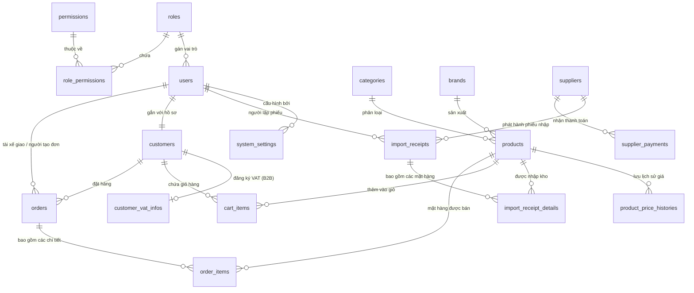

# TÀI LIỆU THIẾT KẾ CƠ SỞ DỮ LIỆU (DATABASE SCHEMA SPECIFICATION)
## DỰ ÁN HỆ THỐNG QUẢN LÝ GAS PRO (PHÁC THẢO CHÍNH THỨC - PHIÊN BẢN 2.0)

> **Người thực hiện:** Senior IT Mentor & Developer  
> **Phiên bản:** v2.0 (Phase 1 + Phase 2 Integrated)  
> **Ngày lập:** 04/08/2026  
> **Phạm vi (Scope):** 
> - **Phase 1:** Quản trị Hệ thống, Tài khoản & Phân quyền RBAC, Danh mục Sản phẩm & Lịch sử Giá, Nhà sản xuất, Nhập kho Multi-Item & Công nợ NSX Gối đầu.
> - **Phase 2:** Hồ sơ Khách hàng B2B/B2C, Thông tin VAT, Giỏ hàng, Đơn bán hàng Master (Orders) & Chi tiết Đơn bán hàng Detail (Order Items), Quản lý nợ gối đầu B2B/B2C, Luồng Nợ tạm thời (Pending Payment).

---

## 📐 1. TỔNG QUAN VÀ NGUYÊN TẮC THIẾT KẾ (3NF & BUSINESS ALIGNMENT)

Cơ sở dữ liệu được chuẩn hóa theo tiêu chuẩn **3NF (Third Normal Form)** trên hệ quản trị RDBMS (**MySQL 8.0 / PostgreSQL 15**) với các nguyên tắc cốt lõi:
1. **Bảo toàn Giá bán Lịch sử (Historical Price Lock - CO-004):** Bảng `order_items` lưu trực tiếp `unit_price` và `unit_deposit_fee` tại thời điểm checkout, độc lập với sự thay đổi giá bán niêm yết trên `products`.
2. **Xét duyệt Điều kiện Ghi nợ Tự động (Credit Eligibility - CD-001):**
   - **B2B (Khách sỉ):** Mua nợ khi thâm niên `> 1 năm` (`first_order_date`) AND số bình gas mua tích lũy `> 20 bình` (`total_cylinders_purchased`). Hạn mức `10,000,000đ` (`DEFAULT_LIMIT_SI`).
   - **B2C (Khách lẻ):** Mua nợ khi thâm niên `> 1 năm` AND số bình gas mua tích lũy `> 10 bình`. Hạn mức `1,000,000đ` (`DEFAULT_LIMIT_LE`).
   - Tự động khóa nợ khi quá hạn 30 ngày hoặc vượt hạn mức nợ (`OVERDUE_LOCKED` / `EXCEEDED_LIMIT`).
3. **Quản lý Tiền cọc Vỏ từng Dòng hàng (Shell Deposit per Line Item):** Lưu trực tiếp `has_exchange_shell` (Có vỏ đổi hay không) và `unit_deposit_fee` (500,000đ/vỏ nếu không đổi) trong `order_items`.
4. **Mô hình Master-Detail chuẩn (1 - N):** 
   - Nhập hàng: `import_receipts` (Master) - `import_receipt_details` (Detail).
   - Bán hàng: `orders` (Master) - `order_items` (Detail).

---

## 📊 2. SƠ ĐỒ QUAN HỆ THỰC THỂ TOÀN CỤC (ERD - MERMAID DIAGRAM)

---

## 🗂️ 3. DANH SÁCH CHI TIẾT CÁC BẢNG (TABLE SCHEMAS)

---

### 🟢 PHẦN I: AUTH, PHÂN QUYỀN & CẤU HÌNH HỆ THỐNG (PHASE 1)

#### 1. Bảng `roles` (Danh mục Vai trò)
| Tên trường | Kiểu dữ liệu | Ràng buộc | Ý nghĩa |
|---|---|---|---|
| `id` | `BIGINT` | `PK`, `AUTO_INCREMENT`, `NOT NULL` | Khóa chính |
| `code` | `VARCHAR(50)` | `UNIQUE`, `NOT NULL` | Mã vai trò (`ADMIN`, `OPERATOR`, `DRIVER`, `CUSTOMER`) |
| `name` | `VARCHAR(100)` | `NOT NULL` | Tên hiển thị vai trò |
| `description` | `VARCHAR(255)` | `NULL` | Mô tả nhiệm vụ |
| `created_at` | `TIMESTAMP` | `DEFAULT CURRENT_TIMESTAMP` | Ngày tạo |
| `updated_at` | `TIMESTAMP` | `DEFAULT CURRENT_TIMESTAMP ON UPDATE` | Ngày cập nhật |

#### 2. Bảng `permissions` (Danh mục Quyền hạn)
| Tên trường | Kiểu dữ liệu | Ràng buộc | Ý nghĩa |
|---|---|---|---|
| `id` | `BIGINT` | `PK`, `AUTO_INCREMENT`, `NOT NULL` | Khóa chính |
| `code` | `VARCHAR(100)` | `UNIQUE`, `NOT NULL` | Mã quyền (`PRODUCT_CREATE`, `DEBT_PAYMENT`...) |
| `name` | `VARCHAR(150)` | `NOT NULL` | Tên quyền hiển thị |
| `module` | `VARCHAR(50)` | `NOT NULL` | Nhóm module (`PRODUCT`, `SUPPLIER`, `ORDER`...) |
| `description` | `VARCHAR(255)` | `NULL` | Diễn giải chi tiết |
| `created_at` | `TIMESTAMP` | `DEFAULT CURRENT_TIMESTAMP` | Ngày tạo |

#### 3. Bảng `role_permissions` (Bảng Trung gian Role - Permission)
| Tên trường | Kiểu dữ liệu | Ràng buộc | Ý nghĩa |
|---|---|---|---|
| `role_id` | `BIGINT` | `PK`, `FK -> roles(id) ON DELETE CASCADE` | Khóa ngoại nối `roles` |
| `permission_id` | `BIGINT` | `PK`, `FK -> permissions(id) ON DELETE CASCADE` | Khóa ngoại nối `permissions` |
| `created_at` | `TIMESTAMP` | `DEFAULT CURRENT_TIMESTAMP` | Ngày gán |

#### 4. Bảng `users` (Tài khoản Người dùng)
| Tên trường | Kiểu dữ liệu | Ràng buộc | Ý nghĩa |
|---|---|---|---|
| `id` | `BIGINT` | `PK`, `AUTO_INCREMENT`, `NOT NULL` | Khóa chính tài khoản |
| `phone` | `VARCHAR(15)` | `UNIQUE`, `NOT NULL` | SĐT (Username đăng nhập) |
| `password_hash` | `VARCHAR(255)` | `NOT NULL` | Mật khẩu mã hóa |
| `full_name` | `VARCHAR(100)` | `NOT NULL` | Họ và tên |
| `email` | `VARCHAR(100)` | `NULL` | Thư điện tử |
| `role_id` | `BIGINT` | `FK -> roles(id) ON DELETE RESTRICT`, `NOT NULL` | Mã vai trò |
| `status` | `VARCHAR(20)` | `DEFAULT 'ACTIVE'`, `NOT NULL` | Trạng thái (`ACTIVE`, `INACTIVE`, `LOCKED`) |
| `avatar_url` | `VARCHAR(255)` | `NULL` | Ảnh đại diện |
| `last_login_at` | `TIMESTAMP` | `NULL` | Đăng nhập gần nhất |
| `created_at` | `TIMESTAMP` | `DEFAULT CURRENT_TIMESTAMP` | Ngày tạo |
| `updated_at` | `TIMESTAMP` | `DEFAULT CURRENT_TIMESTAMP ON UPDATE` | Ngày cập nhật |

#### 5. Bảng `system_settings` (Cấu hình Hằng số Hệ thống)
| Tên trường | Kiểu dữ liệu | Ràng buộc | Ý nghĩa |
|---|---|---|---|
| `id` | `BIGINT` | `PK`, `AUTO_INCREMENT`, `NOT NULL` | Khóa chính |
| `setting_key` | `VARCHAR(100)` | `UNIQUE`, `NOT NULL` | Mã tham số (`D_RATE`, `DEFAULT_LIMIT_LE`, `DEFAULT_LIMIT_SI`...) |
| `setting_value` | `VARCHAR(255)` | `NOT NULL` | Giá trị thiết lập |
| `data_type` | `VARCHAR(20)` | `DEFAULT 'STRING'`, `NOT NULL` | Kiểu dữ liệu (`NUMBER`, `STRING`, `BOOLEAN`) |
| `description` | `TEXT` | `NULL` | Mô tả tham số |
| `updated_by` | `BIGINT` | `FK -> users(id) ON DELETE SET NULL` | Người sửa gần nhất |
| `updated_at` | `TIMESTAMP` | `DEFAULT CURRENT_TIMESTAMP ON UPDATE` | Thời gian sửa |

---

### 🔵 PHẦN II: DANH MỤC SẢN PHẨM, HÃNG & LỊCH SỬ GIÁ (PHASE 1)

#### 6. Bảng `categories` (Loại Sản phẩm)
| Tên trường | Kiểu dữ liệu | Ràng buộc | Ý nghĩa |
|---|---|---|---|
| `id` | `BIGINT` | `PK`, `AUTO_INCREMENT`, `NOT NULL` | Khóa chính |
| `code` | `VARCHAR(50)` | `UNIQUE`, `NOT NULL` | Mã loại (`GAS_CYLINDER`, `GAS_STOVE`, `ACCESSORY`) |
| `name` | `VARCHAR(100)` | `NOT NULL` | Tên loại sản phẩm |
| `description` | `VARCHAR(255)` | `NULL` | Mô tả thêm |
| `created_at` | `TIMESTAMP` | `DEFAULT CURRENT_TIMESTAMP` | Ngày tạo |

#### 7. Bảng `brands` (Hãng Sản xuất)
| Tên trường | Kiểu dữ liệu | Ràng buộc | Ý nghĩa |
|---|---|---|---|
| `id` | `BIGINT` | `PK`, `AUTO_INCREMENT`, `NOT NULL` | Khóa chính |
| `code` | `VARCHAR(50)` | `UNIQUE`, `NOT NULL` | Mã hãng (`PETROLIMEX`, `PVGAS`, `RINNAI`...) |
| `name` | `VARCHAR(100)` | `NOT NULL` | Tên thương hiệu |
| `origin_country` | `VARCHAR(50)` | `DEFAULT 'Việt Nam'` | Xuất xứ |
| `description` | `VARCHAR(255)` | `NULL` | Mô tả hãng |
| `created_at` | `TIMESTAMP` | `DEFAULT CURRENT_TIMESTAMP` | Ngày tạo |

#### 8. Bảng `products` (Danh mục Sản phẩm Gas & Thiết bị)
| Tên trường | Kiểu dữ liệu | Ràng buộc | Ý nghĩa |
|---|---|---|---|
| `id` | `BIGINT` | `PK`, `AUTO_INCREMENT`, `NOT NULL` | Khóa chính sản phẩm |
| `sku` | `VARCHAR(50)` | `UNIQUE`, `NOT NULL` | Mã SKU (`PG-12KG-001`) |
| `name` | `VARCHAR(150)` | `NOT NULL` | Tên sản phẩm |
| `category_id` | `BIGINT` | `FK -> categories(id) ON DELETE RESTRICT` | Loại sản phẩm |
| `brand_id` | `BIGINT` | `FK -> brands(id) ON DELETE RESTRICT` | Hãng sản xuất |
| `specifications` | `VARCHAR(100)` | `NULL` | Quy cách (`12 kg`, `50 kg`, `Bếp đôi`) |
| `current_price` | `DECIMAL(15,2)` | `NOT NULL`, `DEFAULT 0.00` | Giá bán niêm yết hiện tại |
| `default_deposit_fee`| `DECIMAL(15,2)` | `DEFAULT 0.00` | Phí cọc vỏ mặc định (500,000đ/vỏ bình gas) |
| `stock_quantity` | `INT` | `NOT NULL`, `DEFAULT 0` | Số lượng tồn kho gas đầy |
| `empty_shell_stock` | `INT` | `NOT NULL`, `DEFAULT 0` | Số lượng tồn kho vỏ rỗng |
| `safety_threshold` | `INT` | `DEFAULT 10` | Ngưỡng an toàn cảnh báo vỏ rỗng (CI-003) |
| `status` | `VARCHAR(20)` | `DEFAULT 'ACTIVE'`, `NOT NULL` | Trạng thái (`ACTIVE`, `INACTIVE`) |
| `description` | `TEXT` | `NULL` | Mô tả kỹ thuật |
| `image_url` | `VARCHAR(255)` | `NULL` | Đường dẫn ảnh minh họa |
| `created_at` | `TIMESTAMP` | `DEFAULT CURRENT_TIMESTAMP` | Ngày tạo |
| `updated_at` | `TIMESTAMP` | `DEFAULT CURRENT_TIMESTAMP ON UPDATE` | Ngày cập nhật |

#### 9. Bảng `product_price_histories` (Lịch sử Biến động Giá Niêm yết)
| Tên trường | Kiểu dữ liệu | Ràng buộc | Ý nghĩa |
|---|---|---|---|
| `id` | `BIGINT` | `PK`, `AUTO_INCREMENT`, `NOT NULL` | Khóa chính |
| `product_id` | `BIGINT` | `FK -> products(id) ON DELETE CASCADE` | Mã sản phẩm |
| `old_price` | `DECIMAL(15,2)` | `NOT NULL` | Giá niêm yết cũ |
| `new_price` | `DECIMAL(15,2)` | `NOT NULL` | Giá niêm yết mới |
| `old_deposit_fee` | `DECIMAL(15,2)` | `DEFAULT 0.00` | Phí cọc vỏ cũ |
| `new_deposit_fee` | `DECIMAL(15,2)` | `DEFAULT 0.00` | Phí cọc vỏ mới |
| `effective_date` | `TIMESTAMP` | `DEFAULT CURRENT_TIMESTAMP`, `NOT NULL` | Thời điểm áp dụng giá mới |
| `changed_by` | `BIGINT` | `FK -> users(id) ON DELETE SET NULL` | Admin thực hiện đổi giá |
| `note` | `VARCHAR(255)` | `NULL` | Ghi chú lý do đổi giá |

---

### 🟠 PHẦN III: NHÀ SẢN XUẤT & NHẬP KHO MULTI-ITEM (PHASE 1)

#### 10. Bảng `suppliers` (Nhà sản xuất / Nhà cung cấp)
| Tên trường | Kiểu dữ liệu | Ràng buộc | Ý nghĩa |
|---|---|---|---|
| `id` | `BIGINT` | `PK`, `AUTO_INCREMENT`, `NOT NULL` | Khóa chính NSX |
| `code` | `VARCHAR(50)` | `UNIQUE`, `NOT NULL` | Mã nhà sản xuất (`PETRO`, `PVGAS`...) |
| `name` | `VARCHAR(150)` | `NOT NULL` | Tên công ty NSX |
| `phone` | `VARCHAR(15)` | `NULL` | Số điện thoại |
| `email` | `VARCHAR(100)` | `NULL` | Email |
| `address` | `TEXT` | `NULL` | Địa chỉ trụ sở |
| `tax_code` | `VARCHAR(20)` | `NULL` | Mã số thuế NSX |
| `current_debt` | `DECIMAL(15,2)` | `DEFAULT 0.00`, `NOT NULL` | Dư nợ gối đầu hiện tại với NSX |
| `status` | `VARCHAR(20)` | `DEFAULT 'ACTIVE'`, `NOT NULL` | Trạng thái (`ACTIVE`, `INACTIVE`) |
| `created_at` | `TIMESTAMP` | `DEFAULT CURRENT_TIMESTAMP` | Ngày tạo |
| `updated_at` | `TIMESTAMP` | `DEFAULT CURRENT_TIMESTAMP ON UPDATE` | Ngày cập nhật |

#### 11. Bảng `import_receipts` (Phiếu Nhập Kho NSX - Master)
| Tên trường | Kiểu dữ liệu | Ràng buộc | Ý nghĩa |
|---|---|---|---|
| `id` | `BIGINT` | `PK`, `AUTO_INCREMENT`, `NOT NULL` | Khóa chính phiếu nhập |
| `receipt_code` | `VARCHAR(50)` | `UNIQUE`, `NOT NULL` | Mã phiếu nhập (`PN-20260804-001`) |
| `supplier_id` | `BIGINT` | `FK -> suppliers(id) ON DELETE RESTRICT` | Nhà sản xuất |
| `import_date` | `DATE` | `NOT NULL` | Ngày nhập kho |
| `total_amount` | `DECIMAL(15,2)` | `NOT NULL`, `DEFAULT 0.00` | Tổng giá trị toàn phiếu nhập |
| `paid_amount` | `DECIMAL(15,2)` | `NOT NULL`, `DEFAULT 0.00` | Số tiền trả ngay đợt này |
| `debt_amount` | `DECIMAL(15,2)` | `NOT NULL`, `DEFAULT 0.00` | Ghi tăng nợ gối đầu (`total - paid`) |
| `due_date` | `DATE` | `NULL` | Hạn thanh toán nợ gối đầu (+30 ngày) |
| `invoice_code` | `VARCHAR(50)` | `NULL` | Số hóa đơn GTGT |
| `contract_code` | `VARCHAR(50)` | `NULL` | Số hợp đồng nợ gối đầu |
| `payment_status` | `VARCHAR(20)` | `DEFAULT 'UNPAID'`, `NOT NULL` | Trạng thái (`PAID`, `PARTIAL`, `UNPAID`) |
| `note` | `TEXT` | `NULL` | Ghi chú phiếu nhập |
| `created_by` | `BIGINT` | `FK -> users(id) ON DELETE RESTRICT` | Admin lập phiếu |
| `created_at` | `TIMESTAMP` | `DEFAULT CURRENT_TIMESTAMP` | Ngày giờ tạo |

#### 12. Bảng `import_receipt_details` (Chi tiết Mặt hàng Nhập kho - Detail)
| Tên trường | Kiểu dữ liệu | Ràng buộc | Ý nghĩa |
|---|---|---|---|
| `id` | `BIGINT` | `PK`, `AUTO_INCREMENT`, `NOT NULL` | Khóa chính dòng nhập |
| `import_receipt_id`| `BIGINT` | `FK -> import_receipts(id) ON DELETE CASCADE` | Nối về Phiếu nhập Master |
| `product_id` | `BIGINT` | `FK -> products(id) ON DELETE RESTRICT` | Mã sản phẩm nhập |
| `quantity` | `INT` | `NOT NULL` | Số lượng nhập |
| `unit_price` | `DECIMAL(15,2)` | `NOT NULL` | Đơn giá nhập từ NSX |
| `subtotal` | `DECIMAL(15,2)` | `NOT NULL` | Thành tiền dòng (`quantity * unit_price`) |

#### 13. Bảng `supplier_payments` (Lịch sử Thanh toán Nợ NSX)
| Tên trường | Kiểu dữ liệu | Ràng buộc | Ý nghĩa |
|---|---|---|---|
| `id` | `BIGINT` | `PK`, `AUTO_INCREMENT`, `NOT NULL` | Khóa chính đợt trả |
| `payment_code` | `VARCHAR(50)` | `UNIQUE`, `NOT NULL` | Mã đợt thanh toán (`TT-20260804-01`) |
| `supplier_id` | `BIGINT` | `FK -> suppliers(id) ON DELETE RESTRICT` | Nhà sản xuất nhận tiền |
| `import_receipt_id`| `BIGINT` | `FK -> import_receipts(id) ON DELETE SET NULL` | Nối với phiếu nhập cụ thể (nếu có) |
| `payment_date` | `DATE` | `NOT NULL` | Ngày thanh toán |
| `amount` | `DECIMAL(15,2)` | `NOT NULL` | Số tiền chi trả đợt này |
| `remaining_debt` | `DECIMAL(15,2)` | `NOT NULL` | Dư nợ còn lại sau chi |
| `payment_method` | `VARCHAR(50)` | `NOT NULL` | Phương thức (`BANK_TRANSFER`, `CASH`) |
| `transaction_doc` | `VARCHAR(100)` | `NULL` | Mã chứng từ / Số GD Ngân hàng |
| `note` | `TEXT` | `NULL` | Ghi chú chi |
| `created_by` | `BIGINT` | `FK -> users(id) ON DELETE RESTRICT` | Admin lập lệnh chi |
| `created_at` | `TIMESTAMP` | `DEFAULT CURRENT_TIMESTAMP` | Ngày tạo |

---

### 🔴 PHẦN IV: HỒ SƠ KHÁCH HÀNG, VAT & GIỎ HÀNG (PHASE 2 NEW)

#### 14. Bảng `customers` (Hồ sơ Khách hàng B2C & B2B)
* **Mô tả:** Lưu trữ danh tính khách hàng, địa chỉ mặc định, lịch sử tích lũy và trạng thái điều kiện ghi nợ tự động (CD-001).

| Tên trường | Kiểu dữ liệu | Ràng buộc | Ý nghĩa |
|---|---|---|---|
| `id` | `BIGINT` | `PK`, `AUTO_INCREMENT`, `NOT NULL` | Khóa chính khách hàng |
| `user_id` | `BIGINT` | `UNIQUE`, `FK -> users(id) ON DELETE CASCADE`, `NOT NULL` | Nối 1-1 với tài khoản `users` |
| `customer_type` | `VARCHAR(20)` | `NOT NULL`, `DEFAULT 'RETAIL_B2C'` | Phân loại (`RETAIL_B2C`: Khách lẻ, `WHOLESALE_B2B`: Khách sỉ) |
| `contact_name` | `VARCHAR(100)` | `NOT NULL` | Tên người đại diện / Khách hàng |
| `phone` | `VARCHAR(15)` | `NOT NULL` | SĐT nhận hàng |
| `delivery_address` | `TEXT` | `NOT NULL` | Địa chỉ giao hàng mặc định |
| `first_order_date` | `DATE` | `NULL` | Ngày thực hiện đơn hàng đầu tiên (Dùng tính thâm niên `> 1 năm`) |
| `total_cylinders_purchased`| `INT` | `NOT NULL`, `DEFAULT 0` | Tổng số bình gas đã mua tích lũy (B2B `> 20 bình`, B2C `> 10 bình`) |
| `credit_limit` | `DECIMAL(15,2)` | `NOT NULL`, `DEFAULT 0.00` | Hạn mức nợ tối đa được cấp (Lẻ 1M, Sỉ 10M) |
| `current_debt` | `DECIMAL(15,2)` | `NOT NULL`, `DEFAULT 0.00` | Dư nợ công nợ hiện tại của khách |
| `debt_status` | `VARCHAR(25)` | `NOT NULL`, `DEFAULT 'INELIGIBLE'` | Trạng thái nợ (`ELIGIBLE`: Đủ ĐK, `INELIGIBLE`: Chưa đủ ĐK, `EXCEEDED_LIMIT`: Vượt hạn mức, `OVERDUE_LOCKED`: Quá hạn 30 ngày) |
| `is_spam_locked` | `BOOLEAN` | `DEFAULT FALSE`, `NOT NULL` | Khóa COD/Ghi nợ do hủy đơn quá 3 lần/24h (CD-004) |
| `created_at` | `TIMESTAMP` | `DEFAULT CURRENT_TIMESTAMP` | Thời gian tạo hồ sơ |
| `updated_at` | `TIMESTAMP` | `DEFAULT CURRENT_TIMESTAMP ON UPDATE` | Thời gian cập nhật |

#### 15. Bảng `customer_vat_infos` (Thông tin Xuất Hóa Đơn VAT của Khách Sỉ B2B)
* **Mô tả:** Nối 1-1 với `customers`, lưu trữ MST và địa chỉ công ty để tự động xuất hóa đơn GTGT (UM-003).

| Tên trường | Kiểu dữ liệu | Ràng buộc | Ý nghĩa |
|---|---|---|---|
| `id` | `BIGINT` | `PK`, `AUTO_INCREMENT`, `NOT NULL` | Khóa chính |
| `customer_id` | `BIGINT` | `UNIQUE`, `FK -> customers(id) ON DELETE CASCADE`, `NOT NULL` | Nối 1-1 với `customers` |
| `tax_code` | `VARCHAR(20)` | `NOT NULL` | Mã số thuế (10 hoặc 13 số, Regex kiểm tra) |
| `company_name` | `VARCHAR(150)` | `NOT NULL` | Tên công ty / Doanh nghiệp xuất hóa đơn |
| `invoice_address` | `TEXT` | `NOT NULL` | Địa chỉ đăng ký thuế |
| `created_at` | `TIMESTAMP` | `DEFAULT CURRENT_TIMESTAMP` | Ngày tạo |
| `updated_at` | `TIMESTAMP` | `DEFAULT CURRENT_TIMESTAMP ON UPDATE` | Ngày cập nhật |

#### 16. Bảng `cart_items` (Giỏ hàng Tạm thời trên Web/App B2C)
* **Mô tả:** Lưu các sản phẩm tạm tính trong giỏ hàng của khách trước khi Checkout (CO-002).

| Tên trường | Kiểu dữ liệu | Ràng buộc | Ý nghĩa |
|---|---|---|---|
| `id` | `BIGINT` | `PK`, `AUTO_INCREMENT`, `NOT NULL` | Khóa chính dòng giỏ hàng |
| `customer_id` | `BIGINT` | `FK -> customers(id) ON DELETE CASCADE`, `NOT NULL` | Khách hàng chủ sở hữu |
| `product_id` | `BIGINT` | `FK -> products(id) ON DELETE CASCADE`, `NOT NULL` | Sản phẩm trong giỏ |
| `quantity` | `INT` | `NOT NULL`, `DEFAULT 1` | Số lượng mua |
| `has_exchange_shell`| `BOOLEAN` | `NOT NULL`, `DEFAULT TRUE` | Tích chọn "Có vỏ đổi" (True: 0đ cọc, False: +500k/vỏ) |
| `created_at` | `TIMESTAMP` | `DEFAULT CURRENT_TIMESTAMP` | Ngày thêm vào giỏ |
| `updated_at` | `TIMESTAMP` | `DEFAULT CURRENT_TIMESTAMP ON UPDATE` | Cập nhật số lượng |

---

### 🟣 PHẦN V: ĐƠN BÁN HÀNG MASTER & CHI TIẾT ĐƠN HÀNG DETAIL (PHASE 2 NEW)

#### 17. Bảng `orders` (Đơn Bán Hàng Master)
* **Mô tả:** Quản lý toàn bộ tiến trình đơn hàng bán ra, giao nhận, khoảng cách km, thanh toán và hủy đơn đền bù (CO-003, OP-001, SD-001, SD-005).

| Tên trường | Kiểu dữ liệu | Ràng buộc | Ý nghĩa |
|---|---|---|---|
| `id` | `BIGINT` | `PK`, `AUTO_INCREMENT`, `NOT NULL` | Khóa chính đơn hàng |
| `order_code` | `VARCHAR(50)` | `UNIQUE`, `NOT NULL` | Mã đơn hàng (`DH-20260804-001`) |
| `customer_id` | `BIGINT` | `FK -> customers(id) ON DELETE RESTRICT`, `NOT NULL` | Khách hàng mua hàng |
| `driver_id` | `BIGINT` | `FK -> users(id) ON DELETE SET NULL`, `NULL` | Tài xế nhận/được gán giao hàng |
| `created_by` | `BIGINT` | `FK -> users(id) ON DELETE RESTRICT`, `NOT NULL` | Người tạo đơn (Khách tự đặt hoặc Operator tạo hộ) |
| `order_type` | `VARCHAR(20)` | `NOT NULL`, `DEFAULT 'NORMAL'` | Loại đơn (`NORMAL`: Bán gas, `WARRANTY`: Bảo hành, `RETURN`: Đổi trả) |
| `delivery_address` | `TEXT` | `NOT NULL` | Địa chỉ giao hàng chi tiết thực tế |
| `distance_km` | `DECIMAL(5,2)` | `NOT NULL`, `DEFAULT 0.00` | Khoảng cách giao hàng $d$ km (Tính tự động qua Google Maps API) |
| `payment_method` | `VARCHAR(20)` | `NOT NULL` | Phương thức thanh toán (`COD`, `VIETQR`, `CREDIT_DEBT`) |
| `payment_status` | `VARCHAR(20)` | `NOT NULL`, `DEFAULT 'UNPAID'` | Trạng thái thanh toán (`UNPAID`, `PAID`, `PENDING_PAYMENT`: Nợ tạm 24h) |
| `order_status` | `VARCHAR(30)` | `NOT NULL`, `DEFAULT 'PENDING'` | Trạng thái đơn (`PENDING`: Chờ nhận, `ASSIGNED`: Đã gán, `ACCEPTED`: Tài xế đã giật, `DELIVERING`: Đang giao, `COMPLETED`: Hoàn thành, `CANCELLED`: Đã hủy) |
| `total_goods_amount`| `DECIMAL(15,2)`| `NOT NULL`, `DEFAULT 0.00` | Tổng tiền sản phẩm gas & thiết bị |
| `total_deposit_amount`| `DECIMAL(15,2)`| `NOT NULL`, `DEFAULT 0.00` | Tổng tiền cọc vỏ bình gas phát sinh |
| `shipping_fee` | `DECIMAL(15,2)` | `NOT NULL`, `DEFAULT 0.00` | Phí vận chuyển |
| `grand_total` | `DECIMAL(15,2)` | `NOT NULL`, `DEFAULT 0.00` | Tổng thanh toán (`total_goods + total_deposit + shipping`) |
| `notes` | `TEXT` | `NULL` | Ghi chú giao hàng |
| `pending_payment_proof`| `VARCHAR(255)`| `NULL` | Ảnh minh chứng màn hình lỗi ngân hàng (Luồng CD-003) |
| `cancelled_by` | `VARCHAR(20)` | `NULL` | Đối tượng bấm hủy (`CUSTOMER`, `OPERATOR`, `DRIVER`) |
| `cancellation_reason`| `TEXT` | `NULL` | Lý do chi tiết khi hủy đơn |
| `fault_party` | `VARCHAR(20)` | `NULL` | Bên có lỗi khi hủy (`CUSTOMER_FAULT`, `DRIVER_FAULT`, `STORE_FAULT`) |
| `is_driver_compensated`| `BOOLEAN` | `DEFAULT FALSE`, `NOT NULL` | Đã đền bù 50% lương chuyến cho tài xế chưa (SD-005) |
| `accepted_at` | `TIMESTAMP` | `NULL` | Mốc thời gian tài xế giật/nhận đơn thành công |
| `delivering_at` | `TIMESTAMP` | `NULL` | Mốc thời gian tài xế lấy gas xuất kho đi giao |
| `completed_at` | `TIMESTAMP` | `NULL` | Mốc thời gian khách nhận hàng & hoàn thành |
| `cancelled_at` | `TIMESTAMP` | `NULL` | Mốc thời gian đơn bị hủy |
| `created_at` | `TIMESTAMP` | `DEFAULT CURRENT_TIMESTAMP` | Ngày giờ tạo đơn |
| `updated_at` | `TIMESTAMP` | `DEFAULT CURRENT_TIMESTAMP ON UPDATE` | Ngày giờ cập nhật gần nhất |

#### 18. Bảng `order_items` (Chi tiết Mặt hàng Bán ra - Detail)
* **Mô tả:** Danh sách N sản phẩm trong từng đơn hàng, khóa cứng giá bán và phí cọc vỏ tại thời điểm checkout (CO-004).

| Tên trường | Kiểu dữ liệu | Ràng buộc | Ý nghĩa |
|---|---|---|---|
| `id` | `BIGINT` | `PK`, `AUTO_INCREMENT`, `NOT NULL` | Khóa chính dòng sản phẩm bán |
| `order_id` | `BIGINT` | `FK -> orders(id) ON DELETE CASCADE`, `NOT NULL` | Khóa ngoại nối về Đơn hàng Master |
| `product_id` | `BIGINT` | `FK -> products(id) ON DELETE RESTRICT`, `NOT NULL` | Mã sản phẩm mua |
| `product_name` | `VARCHAR(150)` | `NOT NULL` | Tên sản phẩm lưu vết tại thời điểm mua |
| `quantity` | `INT` | `NOT NULL` | Số lượng đặt mua |
| `unit_price` | `DECIMAL(15,2)` | `NOT NULL` | Đơn giá bán tại thời điểm đặt (Khóa đơn giá CO-004) |
| `has_exchange_shell`| `BOOLEAN` | `NOT NULL`, `DEFAULT TRUE` | Khách có vỏ đổi hay không vỏ đổi (0đ / cọc vỏ) |
| `unit_deposit_fee` | `DECIMAL(15,2)` | `NOT NULL`, `DEFAULT 0.00` | Phí cọc vỏ mỗi bình (500,000đ/vỏ nếu `has_exchange_shell = false`) |
| `subtotal` | `DECIMAL(15,2)` | `NOT NULL` | Thành tiền dòng (`quantity * unit_price + (has_exchange_shell ? 0 : quantity * unit_deposit_fee)`) |

---

## 🔗 4. BẢNG MÔ TẢ QUAN HỆ BỔ SUNG PHASE 2 (RELATIONSHIP MATRIX PHASE 2)

| Bảng Nguồn (Source) | Bảng Đích (Target) | Loại quan hệ | Khóa ngoại (Foreign Key) | Hành vi xóa (ON DELETE) | Diễn giải Nghiệp vụ |
|---|---|---|---|---|---|
| `users` | `customers` | 1 - 1 | `customers.user_id` | `CASCADE` | 1 User khách hàng có duy nhất 1 Profile Customer. Xóa User xóa Profile. |
| `customers` | `customer_vat_infos` | 1 - 1 | `customer_vat_infos.customer_id` | `CASCADE` | 1 Khách B2B có duy nhất 1 bộ thông tin VAT. Xóa Khách tự xóa VAT info. |
| `customers` | `cart_items` | 1 - N | `cart_items.customer_id` | `CASCADE` | 1 Khách có nhiều món trong giỏ hàng tạm. |
| `products` | `cart_items` | 1 - N | `cart_items.product_id` | `CASCADE` | 1 Sản phẩm xuất hiện trong nhiều giỏ hàng tạm. |
| `customers` | `orders` | 1 - N | `orders.customer_id` | `RESTRICT` | 1 Khách hàng đặt nhiều đơn hàng. Không xóa Khách nếu đã có đơn bán. |
| `users` (Driver) | `orders` | 1 - N | `orders.driver_id` | `SET NULL` | 1 Tài xế giao nhiều đơn hàng. Xóa tài xế đặt null trên đơn cũ. |
| `orders` | `order_items` | 1 - N | `order_items.order_id` | `CASCADE` | 1 Đơn hàng Master chứa N dòng hàng Detail. Xóa đơn Master xóa dòng chi tiết. |
| `products` | `order_items` | 1 - N | `order_items.product_id` | `RESTRICT` | 1 Sản phẩm nằm trong nhiều đơn hàng. Không xóa SP đã từng bán. |

---

## 🎯 5. KẾT LUẬN & ĐÁNH GIÁ TÍNH TƯƠNG THÍCH (COMPATIBILITY)

1. **Khóa giá chuẩn tuyệt đối:** Cột `order_items.unit_price` bảo toàn 100% đơn giá cũ khi Admin cập nhật bảng `products`.
2. **Khảo sát điều kiện nợ tự động:** Bảng `customers` tích hợp `first_order_date`, `total_cylinders_purchased`, `credit_limit` và `debt_status` kiểm tra nhanh chóng quy tắc nợ B2B (>1 năm, >20 bình) & B2C (>1 năm, >10 bình).
3. **Phí cọc vỏ linh hoạt:** Bảng `order_items` lưu `has_exchange_shell` và `unit_deposit_fee` độc lập trên từng dòng hàng.
4. **Theo dõi luồng Nợ tạm thời (Pending Payment):** Bảng `orders` có `pending_payment_proof` lưu ảnh chụp màn hình lỗi ngân hàng của khách (CD-003).
