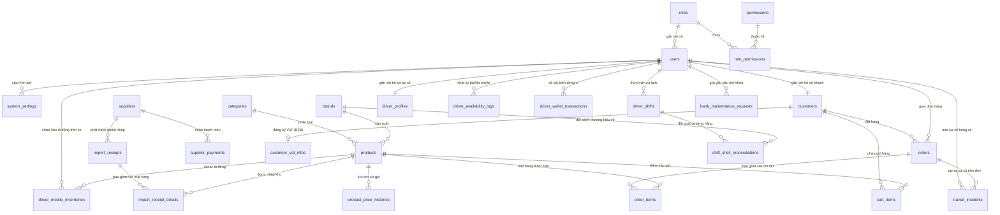

# TÀI LIỆU THIẾT KẾ CƠ SỞ DỮ LIỆU (DATABASE SCHEMA SPECIFICATION)
## DỰ ÁN HỆ THỐNG QUẢN LÝ GAS PRO (PHÁC THẢO CHÍNH THỨC - PHIÊN BẢN 3.0)

> **Người thực hiện:** Senior IT Mentor & Developer  
> **Phiên bản:** v3.0 Complete Enterprise System Schema (Phase 1 + Phase 2 + Phase 3 Integrated)  
> **Ngày lập:** 04/08/2026  
> **Phạm vi (Scope):** 
> - **Phase 1:** Auth & Phân quyền RBAC, Danh mục Sản phẩm & Lịch sử Giá, Nhà sản xuất & Nhập kho Multi-Item.
> - **Phase 2:** Hồ sơ Khách hàng B2B/B2C, Thông tin VAT, Giỏ hàng, Đơn bán hàng Master (Orders) & Detail (Order Items), Quản lý nợ gối đầu B2B/B2C, Luồng Nợ tạm thời.
> - **Phase 3:** Hồ sơ Tài xế, Nhật ký Trực tuyến, Sổ cái Ví Lương (Ledger), Kho Di động trên Xe Tài xế, Nhật ký Sự cố Hỏng xe, Quyết toán Ca làm việc Master (`driver_shifts`), Đối soát Vỏ rỗng Chéo hãng Detail (`shift_shell_reconciliations`), và Xử lý Bảo trì Ngân hàng.

---

## 📐 1. TỔNG QUAN VÀ NGUYÊN TẮC THIẾT KẾ TOÀN HỆ THỐNG (3NF)

Cơ sở dữ liệu hoàn chỉnh bao gồm **26 bảng chuẩn hóa 3NF** đáp ứng 100% các yêu cầu nghiệp vụ trong tài liệu BRD v8, User Stories v5 và Prototype UI:
1. **Bảo toàn Giá bán Lịch sử (Historical Price Lock - CO-004):** Bảng `order_items` lưu trực tiếp `unit_price` và `unit_deposit_fee` tại thời điểm checkout, độc lập với sự thay đổi giá bán niêm yết trên `products`.
2. **Theo dõi Hãng Giao vs Hãng Thu Vỏ (Cross-Brand Shell Tracking):** Bảng `order_items` lưu `delivered_brand_id` (Hãng bình đầy đi giao) và `collected_brand_id` (Hãng vỏ rỗng thực tế thu về từ nhà khách).
3. **Xét duyệt Điều kiện Ghi nợ Tự động (Credit Eligibility - CD-001):**
   - **B2B (Khách sỉ):** Mua nợ khi thâm niên `> 1 năm` (`first_order_date`) AND số bình gas mua tích lũy `> 20 bình` (`total_cylinders_purchased`). Hạn mức `10,000,000đ` (`DEFAULT_LIMIT_SI`).
   - **B2C (Khách lẻ):** Mua nợ khi thâm niên `> 1 năm` AND số bình gas mua tích lũy `> 10 bình`. Hạn mức `1,000,000đ` (`DEFAULT_LIMIT_LE`).
   - Tự động khóa nợ khi quá hạn 30 ngày hoặc vượt hạn mức nợ (`OVERDUE_LOCKED` / `EXCEEDED_LIMIT`).
4. **Sổ Cái Ví Lương Tài Xế (Financial Ledger - BI-003):** Bảng `driver_wallet_transactions` ghi nhận chi tiết từng dòng thu nhập hoa hồng, đền bù hủy đơn 50%, phạt đền vỏ để giải trình với tài xế 100%.
5. **Kho Di Động Trên Xe Tài Xế (Mobile Inventory - WR-003):** Bảng `driver_mobile_inventories` theo dõi số lượng linh kiện và bếp mượn tạm trên từng xe máy của tài xế theo mô hình Rows (N - 1).
6. **Đối soát Vỏ rỗng Chéo hãng Độc lập (RC-003):** Bảng `shift_shell_reconciliations` tách riêng từng dòng thương hiệu (`PG_RONG`, `TOTAL_RONG`, `PMG_RONG`) để so sánh số vỏ kỳ vọng xuất giao vs thực tế thu hồi, tự động tính tiền phạt đền vỏ (`shell_difference * CYLINDER_LOSS_FINE`).

---

## 📊 2. SƠ ĐỒ QUAN HỆ THỰC THỂ TOÀN BỘ HỆ THỐNG (ERD - MERMAID DIAGRAM)

---

## 🗂️ 3. DANH SÁCH CHI TIẾT CÁC BẢNG (FULL TABLE SCHEMAS)

---

### 🟢 PHẦN I: AUTH, PHÂN QUYỀN & CẤU HÌNH HỆ THỐNG

#### 1. Bảng `roles` (Danh mục Vai trò)
| Tên trường | Kiểu dữ liệu | Ràng buộc | Ý nghĩa |
|---|---|---|---|
| `id` | `BIGINT` | `PK`, `AUTO_INCREMENT`, `NOT NULL` | Khóa chính |
| `code` | `VARCHAR(50)` | `UNIQUE`, `NOT NULL` | Mã vai trò (`ADMIN`, `OPERATOR`, `DRIVER`, `CUSTOMER`) |
| `name` | `VARCHAR(100)` | `NOT NULL` | Tên hiển thị vai trò |
| `description` | `VARCHAR(255)` | `NULL` | Mô tả nhiệm vụ |
| `created_at` | `TIMESTAMP` | `DEFAULT CURRENT_TIMESTAMP` | Ngày tạo |
| `updated_at` | `TIMESTAMP` | `DEFAULT CURRENT_TIMESTAMP ON UPDATE` | Ngày cập nhật |

#### 2. Bảng `permissions` (Danh mục Quyền hạn)
| Tên trường | Kiểu dữ liệu | Ràng buộc | Ý nghĩa |
|---|---|---|---|
| `id` | `BIGINT` | `PK`, `AUTO_INCREMENT`, `NOT NULL` | Khóa chính |
| `code` | `VARCHAR(100)` | `UNIQUE`, `NOT NULL` | Mã quyền (`PRODUCT_CREATE`, `DEBT_PAYMENT`...) |
| `name` | `VARCHAR(150)` | `NOT NULL` | Tên quyền hiển thị |
| `module` | `VARCHAR(50)` | `NOT NULL` | Nhóm module (`PRODUCT`, `SUPPLIER`, `ORDER`...) |
| `description` | `VARCHAR(255)` | `NULL` | Diễn giải chi tiết |
| `created_at` | `TIMESTAMP` | `DEFAULT CURRENT_TIMESTAMP` | Ngày tạo |

#### 3. Bảng `role_permissions` (Bảng Trung gian Role - Permission)
| Tên trường | Kiểu dữ liệu | Ràng buộc | Ý nghĩa |
|---|---|---|---|
| `role_id` | `BIGINT` | `PK`, `FK -> roles(id) ON DELETE CASCADE` | Khóa ngoại nối `roles` |
| `permission_id` | `BIGINT` | `PK`, `FK -> permissions(id) ON DELETE CASCADE` | Khóa ngoại nối `permissions` |
| `created_at` | `TIMESTAMP` | `DEFAULT CURRENT_TIMESTAMP` | Ngày gán |

#### 4. Bảng `users` (Tài khoản Người dùng)
| Tên trường | Kiểu dữ liệu | Ràng buộc | Ý nghĩa |
|---|---|---|---|
| `id` | `BIGINT` | `PK`, `AUTO_INCREMENT`, `NOT NULL` | Khóa chính tài khoản |
| `phone` | `VARCHAR(15)` | `UNIQUE`, `NOT NULL` | SĐT (Username đăng nhập) |
| `password_hash` | `VARCHAR(255)` | `NOT NULL` | Mật khẩu mã hóa |
| `full_name` | `VARCHAR(100)` | `NOT NULL` | Họ và tên |
| `email` | `VARCHAR(100)` | `NULL` | Thư điện tử |
| `role_id` | `BIGINT` | `FK -> roles(id) ON DELETE RESTRICT`, `NOT NULL` | Mã vai trò |
| `status` | `VARCHAR(20)` | `DEFAULT 'ACTIVE'`, `NOT NULL` | Trạng thái (`ACTIVE`, `INACTIVE`, `LOCKED`) |
| `avatar_url` | `VARCHAR(255)` | `NULL` | Ảnh đại diện |
| `last_login_at` | `TIMESTAMP` | `NULL` | Đăng nhập gần nhất |
| `created_at` | `TIMESTAMP` | `DEFAULT CURRENT_TIMESTAMP` | Ngày tạo |
| `updated_at` | `TIMESTAMP` | `DEFAULT CURRENT_TIMESTAMP ON UPDATE` | Ngày cập nhật |

#### 5. Bảng `system_settings` (Cấu hình Hằng số Hệ thống)
| Tên trường | Kiểu dữ liệu | Ràng buộc | Ý nghĩa |
|---|---|---|---|
| `id` | `BIGINT` | `PK`, `AUTO_INCREMENT`, `NOT NULL` | Khóa chính |
| `setting_key` | `VARCHAR(100)` | `UNIQUE`, `NOT NULL` | Mã tham số (`D_RATE`, `T_LOCK_OUT`, `CYLINDER_LOSS_FINE`...) |
| `setting_value` | `VARCHAR(255)` | `NOT NULL` | Giá trị thiết lập |
| `data_type` | `VARCHAR(20)` | `DEFAULT 'STRING'`, `NOT NULL` | Kiểu dữ liệu (`NUMBER`, `STRING`, `BOOLEAN`) |
| `description` | `TEXT` | `NULL` | Mô tả tham số |
| `updated_by` | `BIGINT` | `FK -> users(id) ON DELETE SET NULL` | Người sửa gần nhất |
| `updated_at` | `TIMESTAMP` | `DEFAULT CURRENT_TIMESTAMP ON UPDATE` | Thời gian sửa |

---

### 🔵 PHẦN II: DANH MỤC SẢN PHẨM, HÃNG & LỊCH SỬ GIÁ

#### 6. Bảng `categories` (Loại Sản phẩm)
| Tên trường | Kiểu dữ liệu | Ràng buộc | Ý nghĩa |
|---|---|---|---|
| `id` | `BIGINT` | `PK`, `AUTO_INCREMENT`, `NOT NULL` | Khóa chính |
| `code` | `VARCHAR(50)` | `UNIQUE`, `NOT NULL` | Mã loại (`GAS_CYLINDER`, `GAS_STOVE`, `ACCESSORY`) |
| `name` | `VARCHAR(100)` | `NOT NULL` | Tên loại sản phẩm |
| `description` | `VARCHAR(255)` | `NULL` | Mô tả |
| `created_at` | `TIMESTAMP` | `DEFAULT CURRENT_TIMESTAMP` | Ngày tạo |

#### 7. Bảng `brands` (Hãng Sản xuất)
| Tên trường | Kiểu dữ liệu | Ràng buộc | Ý nghĩa |
|---|---|---|---|
| `id` | `BIGINT` | `PK`, `AUTO_INCREMENT`, `NOT NULL` | Khóa chính |
| `code` | `VARCHAR(50)` | `UNIQUE`, `NOT NULL` | Mã hãng (`PETROLIMEX`, `PVGAS`, `RINNAI`...) |
| `name` | `VARCHAR(100)` | `NOT NULL` | Tên thương hiệu |
| `origin_country` | `VARCHAR(50)` | `DEFAULT 'Việt Nam'` | Xuất xứ |
| `description` | `VARCHAR(255)` | `NULL` | Mô tả |
| `created_at` | `TIMESTAMP` | `DEFAULT CURRENT_TIMESTAMP` | Ngày tạo |

#### 8. Bảng `products` (Danh mục Sản phẩm Gas & Thiết bị)
| Tên trường | Kiểu dữ liệu | Ràng buộc | Ý nghĩa |
|---|---|---|---|
| `id` | `BIGINT` | `PK`, `AUTO_INCREMENT`, `NOT NULL` | Khóa chính |
| `sku` | `VARCHAR(50)` | `UNIQUE`, `NOT NULL` | Mã SKU (`PG-12KG-001`) |
| `name` | `VARCHAR(150)` | `NOT NULL` | Tên sản phẩm |
| `category_id` | `BIGINT` | `FK -> categories(id) ON DELETE RESTRICT` | Loại sản phẩm |
| `brand_id` | `BIGINT` | `FK -> brands(id) ON DELETE RESTRICT` | Hãng sản xuất |
| `specifications` | `VARCHAR(100)` | `NULL` | Quy cách (`12 kg`, `50 kg`) |
| `current_price` | `DECIMAL(15,2)` | `NOT NULL`, `DEFAULT 0.00` | Giá bán niêm yết hiện tại |
| `default_deposit_fee`| `DECIMAL(15,2)` | `DEFAULT 0.00` | Phí cọc vỏ mặc định (500,000đ/vỏ) |
| `stock_quantity` | `INT` | `NOT NULL`, `DEFAULT 0` | Số lượng tồn kho gas đầy |
| `empty_shell_stock` | `INT` | `NOT NULL`, `DEFAULT 0` | Số lượng tồn kho vỏ rỗng |
| `safety_threshold` | `INT` | `DEFAULT 10` | Ngưỡng an toàn vỏ rỗng (CI-003) |
| `status` | `VARCHAR(20)` | `DEFAULT 'ACTIVE'`, `NOT NULL` | Trạng thái (`ACTIVE`, `INACTIVE`) |
| `description` | `TEXT` | `NULL` | Mô tả kỹ thuật |
| `image_url` | `VARCHAR(255)` | `NULL` | Ảnh sản phẩm |
| `created_at` | `TIMESTAMP` | `DEFAULT CURRENT_TIMESTAMP` | Ngày tạo |
| `updated_at` | `TIMESTAMP` | `DEFAULT CURRENT_TIMESTAMP ON UPDATE` | Ngày cập nhật |

#### 9. Bảng `product_price_histories` (Lịch sử Biến động Giá Niêm yết)
| Tên trường | Kiểu dữ liệu | Ràng buộc | Ý nghĩa |
|---|---|---|---|
| `id` | `BIGINT` | `PK`, `AUTO_INCREMENT`, `NOT NULL` | Khóa chính |
| `product_id` | `BIGINT` | `FK -> products(id) ON DELETE CASCADE` | Mã sản phẩm |
| `old_price` | `DECIMAL(15,2)` | `NOT NULL` | Giá bán cũ |
| `new_price` | `DECIMAL(15,2)` | `NOT NULL` | Giá bán mới |
| `old_deposit_fee` | `DECIMAL(15,2)` | `DEFAULT 0.00` | Phí cọc vỏ cũ |
| `new_deposit_fee` | `DECIMAL(15,2)` | `DEFAULT 0.00` | Phí cọc vỏ mới |
| `effective_date` | `TIMESTAMP` | `DEFAULT CURRENT_TIMESTAMP`, `NOT NULL` | Ngày có hiệu lực |
| `changed_by` | `BIGINT` | `FK -> users(id) ON DELETE SET NULL` | Admin đổi giá |
| `note` | `VARCHAR(255)` | `NULL` | Lý do đổi giá |

---

### 🟠 PHẦN III: NHÀ SẢN XUẤT & NHẬP KHO MULTI-ITEM

#### 10. Bảng `suppliers` (Nhà sản xuất / Nhà cung cấp)
| Tên trường | Kiểu dữ liệu | Ràng buộc | Ý nghĩa |
|---|---|---|---|
| `id` | `BIGINT` | `PK`, `AUTO_INCREMENT`, `NOT NULL` | Khóa chính NSX |
| `code` | `VARCHAR(50)` | `UNIQUE`, `NOT NULL` | Mã NSX (`PETRO`, `PVGAS`...) |
| `name` | `VARCHAR(150)` | `NOT NULL` | Tên công ty NSX |
| `phone` | `VARCHAR(15)` | `NULL` | Số điện thoại |
| `email` | `VARCHAR(100)` | `NULL` | Email |
| `address` | `TEXT` | `NULL` | Địa chỉ |
| `tax_code` | `VARCHAR(20)` | `NULL` | Mã số thuế |
| `current_debt` | `DECIMAL(15,2)` | `DEFAULT 0.00`, `NOT NULL` | Dư nợ gối đầu hiện tại |
| `status` | `VARCHAR(20)` | `DEFAULT 'ACTIVE'`, `NOT NULL` | Trạng thái |
| `created_at` | `TIMESTAMP` | `DEFAULT CURRENT_TIMESTAMP` | Ngày tạo |
| `updated_at` | `TIMESTAMP` | `DEFAULT CURRENT_TIMESTAMP ON UPDATE` | Ngày cập nhật |

#### 11. Bảng `import_receipts` (Phiếu Nhập Kho NSX - Master)
| Tên trường | Kiểu dữ liệu | Ràng buộc | Ý nghĩa |
|---|---|---|---|
| `id` | `BIGINT` | `PK`, `AUTO_INCREMENT`, `NOT NULL` | Khóa chính |
| `receipt_code` | `VARCHAR(50)` | `UNIQUE`, `NOT NULL` | Mã phiếu nhập (`PN-20260804-001`) |
| `supplier_id` | `BIGINT` | `FK -> suppliers(id) ON DELETE RESTRICT` | Nhà sản xuất |
| `import_date` | `DATE` | `NOT NULL` | Ngày nhập |
| `total_amount` | `DECIMAL(15,2)` | `NOT NULL`, `DEFAULT 0.00` | Tổng tiền toàn phiếu |
| `paid_amount` | `DECIMAL(15,2)` | `NOT NULL`, `DEFAULT 0.00` | Trả ngay |
| `debt_amount` | `DECIMAL(15,2)` | `NOT NULL`, `DEFAULT 0.00` | Nợ gối đầu (`total - paid`) |
| `due_date` | `DATE` | `NULL` | Hạn trả nợ (+30 ngày) |
| `invoice_code` | `VARCHAR(50)` | `NULL` | Số HĐ GTGT |
| `contract_code` | `VARCHAR(50)` | `NULL` | Số HĐ nợ gối đầu |
| `payment_status` | `VARCHAR(20)` | `DEFAULT 'UNPAID'`, `NOT NULL` | Trạng thái thanh toán |
| `note` | `TEXT` | `NULL` | Ghi chú |
| `created_by` | `BIGINT` | `FK -> users(id) ON DELETE RESTRICT` | Admin lập phiếu |
| `created_at` | `TIMESTAMP` | `DEFAULT CURRENT_TIMESTAMP` | Ngày tạo |

#### 12. Bảng `import_receipt_details` (Chi tiết Mặt hàng Nhập kho - Detail)
| Tên trường | Kiểu dữ liệu | Ràng buộc | Ý nghĩa |
|---|---|---|---|
| `id` | `BIGINT` | `PK`, `AUTO_INCREMENT`, `NOT NULL` | Khóa chính dòng |
| `import_receipt_id`| `BIGINT` | `FK -> import_receipts(id) ON DELETE CASCADE` | Nối về Master |
| `product_id` | `BIGINT` | `FK -> products(id) ON DELETE RESTRICT` | Mã sản phẩm nhập |
| `quantity` | `INT` | `NOT NULL` | Số lượng |
| `unit_price` | `DECIMAL(15,2)` | `NOT NULL` | Đơn giá nhập từ NSX |
| `subtotal` | `DECIMAL(15,2)` | `NOT NULL` | Thành tiền (`quantity * unit_price`) |

#### 13. Bảng `supplier_payments` (Lịch sử Thanh toán Nợ NSX)
| Tên trường | Kiểu dữ liệu | Ràng buộc | Ý nghĩa |
|---|---|---|---|
| `id` | `BIGINT` | `PK`, `AUTO_INCREMENT`, `NOT NULL` | Khóa chính đợt trả |
| `payment_code` | `VARCHAR(50)` | `UNIQUE`, `NOT NULL` | Mã đợt trả (`TT-20260804-01`) |
| `supplier_id` | `BIGINT` | `FK -> suppliers(id) ON DELETE RESTRICT` | NSX nhận tiền |
| `import_receipt_id`| `BIGINT` | `FK -> import_receipts(id) ON DELETE SET NULL` | Nối với phiếu cụ thể |
| `payment_date` | `DATE` | `NOT NULL` | Ngày chi |
| `amount` | `DECIMAL(15,2)` | `NOT NULL` | Số tiền trả đợt này |
| `remaining_debt` | `DECIMAL(15,2)` | `NOT NULL` | Dư nợ còn lại sau chi |
| `payment_method` | `VARCHAR(50)` | `NOT NULL` | Phương thức (`BANK_TRANSFER`, `CASH`) |
| `transaction_doc` | `VARCHAR(100)` | `NULL` | Mã chứng từ ngân hàng |
| `note` | `TEXT` | `NULL` | Ghi chú |
| `created_by` | `BIGINT` | `FK -> users(id) ON DELETE RESTRICT` | Admin lập lệnh chi |
| `created_at` | `TIMESTAMP` | `DEFAULT CURRENT_TIMESTAMP` | Ngày tạo |

---

### 🔴 PHẦN IV: HỒ SƠ KHÁCH HÀNG, VAT & GIỎ HÀNG

#### 14. Bảng `customers` (Hồ sơ Khách hàng B2C & B2B)
| Tên trường | Kiểu dữ liệu | Ràng buộc | Ý nghĩa |
|---|---|---|---|
| `id` | `BIGINT` | `PK`, `AUTO_INCREMENT`, `NOT NULL` | Khóa chính |
| `user_id` | `BIGINT` | `UNIQUE`, `FK -> users(id) ON DELETE CASCADE`, `NOT NULL` | Nối 1-1 với `users` |
| `customer_type` | `VARCHAR(20)` | `NOT NULL`, `DEFAULT 'RETAIL_B2C'` | Phân loại (`RETAIL_B2C`, `WHOLESALE_B2B`) |
| `contact_name` | `VARCHAR(100)` | `NOT NULL` | Họ tên khách hàng |
| `phone` | `VARCHAR(15)` | `NOT NULL` | SĐT nhận hàng |
| `delivery_address` | `TEXT` | `NOT NULL` | Địa chỉ giao hàng mặc định |
| `first_order_date` | `DATE` | `NULL` | Ngày đơn đầu (Tính thâm niên `> 1 năm`) |
| `total_cylinders_purchased`| `INT` | `NOT NULL`, `DEFAULT 0` | Số bình gas đã mua (B2B `>20`, B2C `>10`) |
| `credit_limit` | `DECIMAL(15,2)` | `NOT NULL`, `DEFAULT 0.00` | Hạn mức nợ (Lẻ 1M, Sỉ 10M) |
| `current_debt` | `DECIMAL(15,2)` | `NOT NULL`, `DEFAULT 0.00` | Dư nợ hiện tại |
| `debt_status` | `VARCHAR(25)` | `NOT NULL`, `DEFAULT 'INELIGIBLE'` | Trạng thái nợ (`ELIGIBLE`, `INELIGIBLE`, `EXCEEDED_LIMIT`, `OVERDUE_LOCKED`) |
| `is_spam_locked` | `BOOLEAN` | `DEFAULT FALSE`, `NOT NULL` | Khóa COD/Nợ do hủy đơn 3 lần/24h |
| `created_at` | `TIMESTAMP` | `DEFAULT CURRENT_TIMESTAMP` | Ngày tạo |
| `updated_at` | `TIMESTAMP` | `DEFAULT CURRENT_TIMESTAMP ON UPDATE` | Ngày cập nhật |

#### 15. Bảng `customer_vat_infos` (Thông tin VAT Khách Sỉ B2B)
| Tên trường | Kiểu dữ liệu | Ràng buộc | Ý nghĩa |
|---|---|---|---|
| `id` | `BIGINT` | `PK`, `AUTO_INCREMENT`, `NOT NULL` | Khóa chính |
| `customer_id` | `BIGINT` | `UNIQUE`, `FK -> customers(id) ON DELETE CASCADE`, `NOT NULL` | Nối 1-1 với `customers` |
| `tax_code` | `VARCHAR(20)` | `NOT NULL` | Mã số thuế (10/13 số) |
| `company_name` | `VARCHAR(150)` | `NOT NULL` | Tên công ty/DN xuất hóa đơn |
| `invoice_address` | `TEXT` | `NOT NULL` | Địa chỉ đăng ký thuế |
| `created_at` | `TIMESTAMP` | `DEFAULT CURRENT_TIMESTAMP` | Ngày tạo |
| `updated_at` | `TIMESTAMP` | `DEFAULT CURRENT_TIMESTAMP ON UPDATE` | Ngày cập nhật |

#### 16. Bảng `cart_items` (Giỏ hàng Tạm thời)
| Tên trường | Kiểu dữ liệu | Ràng buộc | Ý nghĩa |
|---|---|---|---|
| `id` | `BIGINT` | `PK`, `AUTO_INCREMENT`, `NOT NULL` | Khóa chính |
| `customer_id` | `BIGINT` | `FK -> customers(id) ON DELETE CASCADE`, `NOT NULL` | Khách hàng chủ sở hữu |
| `product_id` | `BIGINT` | `FK -> products(id) ON DELETE CASCADE`, `NOT NULL` | Sản phẩm trong giỏ |
| `quantity` | `INT` | `NOT NULL`, `DEFAULT 1` | Số lượng mua |
| `has_exchange_shell`| `BOOLEAN` | `NOT NULL`, `DEFAULT TRUE` | Có vỏ đổi hay không (True: 0đ, False: +500k) |
| `created_at` | `TIMESTAMP` | `DEFAULT CURRENT_TIMESTAMP` | Ngày tạo |
| `updated_at` | `TIMESTAMP` | `DEFAULT CURRENT_TIMESTAMP ON UPDATE` | Ngày cập nhật |

---

### 🟣 PHẦN V: ĐƠN BÁN HÀNG MASTER & DETAIL

#### 17. Bảng `orders` (Đơn Bán Hàng Master)
| Tên trường | Kiểu dữ liệu | Ràng buộc | Ý nghĩa |
|---|---|---|---|
| `id` | `BIGINT` | `PK`, `AUTO_INCREMENT`, `NOT NULL` | Khóa chính đơn hàng |
| `order_code` | `VARCHAR(50)` | `UNIQUE`, `NOT NULL` | Mã đơn (`DH-20260804-001`) |
| `customer_id` | `BIGINT` | `FK -> customers(id) ON DELETE RESTRICT`, `NOT NULL` | Khách hàng |
| `driver_id` | `BIGINT` | `FK -> users(id) ON DELETE SET NULL`, `NULL` | Tài xế nhận/được gán giao |
| `created_by` | `BIGINT` | `FK -> users(id) ON DELETE RESTRICT`, `NOT NULL` | Người tạo đơn |
| `order_type` | `VARCHAR(20)` | `NOT NULL`, `DEFAULT 'NORMAL'` | Loại đơn (`NORMAL`, `WARRANTY`, `RETURN`) |
| `delivery_address` | `TEXT` | `NOT NULL` | Địa chỉ giao thực tế |
| `distance_km` | `DECIMAL(5,2)` | `NOT NULL`, `DEFAULT 0.00` | Khoảng cách $d$ km (Google Maps API) |
| `payment_method` | `VARCHAR(20)` | `NOT NULL` | PTTT (`COD`, `VIETQR`, `CREDIT_DEBT`) |
| `payment_status` | `VARCHAR(20)` | `NOT NULL`, `DEFAULT 'UNPAID'` | Trạng thái thanh toán (`UNPAID`, `PAID`, `PENDING_PAYMENT`) |
| `order_status` | `VARCHAR(30)` | `NOT NULL`, `DEFAULT 'PENDING'` | Trạng thái đơn (`PENDING`, `ASSIGNED`, `ACCEPTED`, `DELIVERING`, `COMPLETED`, `CANCELLED`) |
| `total_goods_amount`| `DECIMAL(15,2)`| `NOT NULL`, `DEFAULT 0.00` | Tổng tiền hàng |
| `total_deposit_amount`| `DECIMAL(15,2)`| `NOT NULL`, `DEFAULT 0.00` | Tổng phí cọc vỏ phát sinh |
| `shipping_fee` | `DECIMAL(15,2)` | `NOT NULL`, `DEFAULT 0.00` | Phí giao hàng |
| `grand_total` | `DECIMAL(15,2)` | `NOT NULL`, `DEFAULT 0.00` | Tổng thanh toán toàn đơn |
| `notes` | `TEXT` | `NULL` | Ghi chú giao hàng |
| `pending_payment_proof`| `VARCHAR(255)`| `NULL` | Minh chứng ảnh lỗi ngân hàng (CD-003) |
| `cancelled_by` | `VARCHAR(20)` | `NULL` | Ai bấm hủy (`CUSTOMER`, `OPERATOR`, `DRIVER`) |
| `cancellation_reason`| `TEXT` | `NULL` | Lý do hủy đơn |
| `fault_party` | `VARCHAR(20)` | `NULL` | Bên chịu trách nhiệm (`CUSTOMER_FAULT`, `DRIVER_FAULT`, `STORE_FAULT`) |
| `is_driver_compensated`| `BOOLEAN` | `DEFAULT FALSE`, `NOT NULL` | Đã đền 50% lương chuyến chưa |
| `accepted_at` | `TIMESTAMP` | `NULL` | Ngày giờ tài xế nhận/giật đơn |
| `delivering_at` | `TIMESTAMP` | `NULL` | Ngày giờ xuất kho đi giao |
| `completed_at` | `TIMESTAMP` | `NULL` | Ngày giờ hoàn thành đơn |
| `cancelled_at` | `TIMESTAMP` | `NULL` | Ngày giờ hủy đơn |
| `created_at` | `TIMESTAMP` | `DEFAULT CURRENT_TIMESTAMP` | Ngày tạo |
| `updated_at` | `TIMESTAMP` | `DEFAULT CURRENT_TIMESTAMP ON UPDATE` | Ngày cập nhật |

#### 18. Bảng `order_items` (Chi tiết Mặt hàng Bán ra - Detail)
| Tên trường | Kiểu dữ liệu | Ràng buộc | Ý nghĩa |
|---|---|---|---|
| `id` | `BIGINT` | `PK`, `AUTO_INCREMENT`, `NOT NULL` | Khóa chính dòng bán |
| `order_id` | `BIGINT` | `FK -> orders(id) ON DELETE CASCADE`, `NOT NULL` | Khóa ngoại nối Master |
| `product_id` | `BIGINT` | `FK -> products(id) ON DELETE RESTRICT`, `NOT NULL` | Mã sản phẩm |
| `product_name` | `VARCHAR(150)` | `NOT NULL` | Tên sản phẩm lưu vết |
| `quantity` | `INT` | `NOT NULL` | Số lượng mua |
| `unit_price` | `DECIMAL(15,2)` | `NOT NULL` | Đơn giá bán tại thời điểm mua (CO-004) |
| `has_exchange_shell`| `BOOLEAN` | `NOT NULL`, `DEFAULT TRUE` | Có vỏ đổi hay cọc vỏ |
| `delivered_brand_id`| `BIGINT` | `FK -> brands(id) ON DELETE RESTRICT`, `NULL` | Thương hiệu gas giao cho khách |
| `collected_brand_id`| `BIGINT` | `FK -> brands(id) ON DELETE RESTRICT`, `NULL` | Thương hiệu vỏ rỗng khách thu về (Đối lưu chéo hãng) |
| `unit_deposit_fee` | `DECIMAL(15,2)` | `NOT NULL`, `DEFAULT 0.00` | Phí cọc vỏ mỗi bình |
| `subtotal` | `DECIMAL(15,2)` | `NOT NULL` | Thành tiền dòng |

---

### 🟡 PHẦN VI: HỒ SƠ TÀI XẾ, SỰ CỐ, KHO DI ĐỘNG & QUYẾT TOÁN CA (PHASE 3 COMPLETE)

#### 19. Bảng `driver_profiles` (Hồ sơ & Trạng thái Vận hành Tài xế)
| Tên trường | Kiểu dữ liệu | Ràng buộc | Ý nghĩa |
|---|---|---|---|
| `id` | `BIGINT` | `PK`, `AUTO_INCREMENT`, `NOT NULL` | Khóa chính |
| `user_id` | `BIGINT` | `UNIQUE`, `FK -> users(id) ON DELETE CASCADE`, `NOT NULL` | Nối 1-1 với `users` |
| `license_number` | `VARCHAR(30)` | `NULL` | Số GPLX |
| `vehicle_plate` | `VARCHAR(20)` | `NULL` | Biển số xe giao hàng |
| `is_online` | `BOOLEAN` | `DEFAULT FALSE`, `NOT NULL` | Trực tuyến / Ngoại tuyến |
| `active_orders_count`| `INT` | `DEFAULT 0`, `NOT NULL` | Đơn đang giao (Tối đa 3 đơn SD-002) |
| `locked_until` | `TIMESTAMP` | `NULL` | Thời điểm hết bị phạt khóa App (`T_LOCK_OUT`) |
| `lockout_reason` | `VARCHAR(255)` | `NULL` | Lý do bị phạt khóa App |
| `accumulated_salary`| `DECIMAL(15,2)`| `DEFAULT 0.00`, `NOT NULL` | Ví lương tích lũy ($d \times \text{D\_RATE} + \text{Đền 50\%} - \text{Phạt}$) |
| `total_completed_orders`| `INT` | `DEFAULT 0`, `NOT NULL` | Tổng đơn giao thành công |
| `total_failed_orders` | `INT` | `DEFAULT 0`, `NOT NULL` | Tổng đơn từ chối / hủy lỗi |
| `created_at` | `TIMESTAMP` | `DEFAULT CURRENT_TIMESTAMP` | Ngày tạo |
| `updated_at` | `TIMESTAMP` | `DEFAULT CURRENT_TIMESTAMP ON UPDATE` | Ngày cập nhật |

#### 20. Bảng `driver_availability_logs` (Nhật ký Bật/Tắt Trực tuyến Tài xế)
| Tên trường | Kiểu dữ liệu | Ràng buộc | Ý nghĩa |
|---|---|---|---|
| `id` | `BIGINT` | `PK`, `AUTO_INCREMENT`, `NOT NULL` | Khóa chính |
| `driver_id` | `BIGINT` | `FK -> users(id) ON DELETE CASCADE`, `NOT NULL` | Tài xế thực hiện |
| `event_type` | `VARCHAR(20)` | `NOT NULL` | Loại sự kiện (`ONLINE`, `OFFLINE`) |
| `location_lat_long` | `VARCHAR(100)` | `NULL` | Tọa độ GPS khi bật/tắt |
| `created_at` | `TIMESTAMP` | `DEFAULT CURRENT_TIMESTAMP` | Ngày giờ ghi log |

#### 21. Bảng `driver_wallet_transactions` (Sổ Cái Nhật Ký Biến Động Ví Lương Tài Xế)
| Tên trường | Kiểu dữ liệu | Ràng buộc | Ý nghĩa |
|---|---|---|---|
| `id` | `BIGINT` | `PK`, `AUTO_INCREMENT`, `NOT NULL` | Khóa chính giao dịch ví |
| `driver_id` | `BIGINT` | `FK -> users(id) ON DELETE CASCADE`, `NOT NULL` | Tài xế sở hữu ví |
| `transaction_type` | `VARCHAR(50)` | `NOT NULL` | Loại giao dịch (`TRIP_COMMISSION`: Lương chuyến, `CANCEL_COMPENSATION`: Đền bù 50%, `SHELL_LOSS_PENALTY`: Phạt vỏ, `COD_DEFICIT_DEDUCTION`: Trừ COD thiếu, `PAYOUT_WITHDRAWAL`: Rút lương) |
| `amount` | `DECIMAL(15,2)` | `NOT NULL` | Số tiền biến động (+/-) |
| `balance_after` | `DECIMAL(15,2)` | `NOT NULL` | Số dư ví lương ngay sau giao dịch |
| `reference_order_id`| `BIGINT` | `FK -> orders(id) ON DELETE SET NULL`, `NULL` | Mã đơn hàng liên quan |
| `reference_shift_id`| `BIGINT` | `FK -> driver_shifts(id) ON DELETE SET NULL`, `NULL` | Ca làm liên quan |
| `description` | `VARCHAR(255)` | `NULL` | Diễn giải chi tiết giao dịch |
| `created_at` | `TIMESTAMP` | `DEFAULT CURRENT_TIMESTAMP` | Ngày giờ phát sinh |

#### 22. Bảng `driver_mobile_inventories` (Kho Di Động Linh Kiện Trên Xe Tài Xế)
| Tên trường | Kiểu dữ liệu | Ràng buộc | Ý nghĩa |
|---|---|---|---|
| `id` | `BIGINT` | `PK`, `AUTO_INCREMENT`, `NOT NULL` | Khóa chính dòng kho di động |
| `driver_id` | `BIGINT` | `FK -> users(id) ON DELETE CASCADE`, `NOT NULL` | Tài xế phụ trách xe |
| `product_id` | `BIGINT` | `FK -> products(id) ON DELETE RESTRICT`, `NOT NULL` | Linh kiện / Bếp mượn trên xe |
| `quantity` | `INT` | `NOT NULL`, `DEFAULT 0` | Số lượng hiện có trên cốp xe |
| `updated_at` | `TIMESTAMP` | `DEFAULT CURRENT_TIMESTAMP ON UPDATE` | Cập nhật kho di động |

#### 23. Bảng `transit_incidents` (Nhật ký Sự cố Hỏng xe Dọc đường)
| Tên trường | Kiểu dữ liệu | Ràng buộc | Ý nghĩa |
|---|---|---|---|
| `id` | `BIGINT` | `PK`, `AUTO_INCREMENT`, `NOT NULL` | Khóa chính |
| `driver_id` | `BIGINT` | `FK -> users(id) ON DELETE RESTRICT`, `NOT NULL` | Tài xế báo sự cố |
| `order_id` | `BIGINT` | `FK -> orders(id) ON DELETE CASCADE`, `NOT NULL` | Đơn hàng gặp sự cố |
| `incident_type` | `VARCHAR(50)` | `NOT NULL` | Loại sự cố (`VEHICLE_BREAKDOWN`, `ACCIDENT`, `OTHER`) |
| `description` | `TEXT` | `NULL` | Mô tả tình trạng |
| `proof_image_url` | `VARCHAR(255)` | `NOT NULL` | Ảnh minh chứng thực địa (Bắt buộc) |
| `status` | `VARCHAR(20)` | `DEFAULT 'PENDING'`, `NOT NULL` | Trạng thái (`PENDING`, `RELEASED`, `RESOLVED`) |
| `resolved_by` | `BIGINT` | `FK -> users(id) ON DELETE SET NULL`, `NULL` | Operator tiếp nhận xử lý |
| `created_at` | `TIMESTAMP` | `DEFAULT CURRENT_TIMESTAMP` | Ngày giờ báo sự cố |

#### 24. Bảng `driver_shifts` (Quyết toán Ca Vận hành Master)
| Tên trường | Kiểu dữ liệu | Ràng buộc | Ý nghĩa |
|---|---|---|---|
| `id` | `BIGINT` | `PK`, `AUTO_INCREMENT`, `NOT NULL` | Khóa chính ca làm |
| `driver_id` | `BIGINT` | `FK -> users(id) ON DELETE RESTRICT`, `NOT NULL` | Tài xế trực ca |
| `shift_date` | `DATE` | `NOT NULL` | Ngày làm việc |
| `start_time` | `TIMESTAMP` | `NOT NULL` | Thời điểm bắt đầu ca (Bật Online) |
| `end_time` | `TIMESTAMP` | `NULL` | Thời điểm kết thúc ca |
| `expected_cod` | `DECIMAL(15,2)` | `NOT NULL`, `DEFAULT 0.00` | Tổng COD phải thu trong ca |
| `actual_cod_cash` | `DECIMAL(15,2)` | `NOT NULL`, `DEFAULT 0.00` | Tiền mặt COD thực nộp tại quầy |
| `actual_cod_qr` | `DECIMAL(15,2)` | `NOT NULL`, `DEFAULT 0.00` | Tiền COD đã nộp qua VietQR trong ca |
| `cod_deficit` | `DECIMAL(15,2)` | `NOT NULL`, `DEFAULT 0.00` | Tiền COD bị thiếu (Trừ lương ca) |
| `total_trip_salary` | `DECIMAL(15,2)` | `NOT NULL`, `DEFAULT 0.00` | Tổng lương chuyến trong ca |
| `total_loss_penalty`| `DECIMAL(15,2)` | `NOT NULL`, `DEFAULT 0.00` | Tổng tiền phạt làm mất vỏ bình |
| `net_payout` | `DECIMAL(15,2)` | `NOT NULL`, `DEFAULT 0.00` | Lương thực nhận ca (`trip_salary - cod_deficit - loss_penalty`) |
| `shift_status` | `VARCHAR(20)` | `NOT NULL`, `DEFAULT 'OPEN'` | Trạng thái (`OPEN`, `PENDING_CLOSE`, `CLOSED`) |
| `reconciled_by` | `BIGINT` | `FK -> users(id) ON DELETE SET NULL`, `NULL` | Thủ kho duyệt đóng ca |
| `created_at` | `TIMESTAMP` | `DEFAULT CURRENT_TIMESTAMP` | Ngày tạo |

#### 25. Bảng `shift_shell_reconciliations` (Đối soát Vỏ rỗng Chéo hãng Detail)
| Tên trường | Kiểu dữ liệu | Ràng buộc | Ý nghĩa |
|---|---|---|---|
| `id` | `BIGINT` | `PK`, `AUTO_INCREMENT`, `NOT NULL` | Khóa chính dòng đối soát vỏ |
| `shift_id` | `BIGINT` | `FK -> driver_shifts(id) ON DELETE CASCADE`, `NOT NULL` | Ca làm việc Master |
| `brand_id` | `BIGINT` | `FK -> brands(id) ON DELETE RESTRICT`, `NOT NULL` | Hãng vỏ rỗng đối soát |
| `expected_shell_count`| `INT` | `NOT NULL`, `DEFAULT 0` | Số vỏ phải thu về theo đơn |
| `actual_shell_count` | `INT` | `NOT NULL`, `DEFAULT 0` | Số vỏ thực nộp cho thủ kho |
| `cross_exchange_shells`| `INT` | `NOT NULL`, `DEFAULT 0` | Số vỏ đổi chéo thu hộ hãng khác |
| `shell_difference` | `INT` | `NOT NULL`, `DEFAULT 0` | Chênh lệch vỏ (`expected - actual`) |
| `loss_penalty_amount` | `DECIMAL(15,2)` | `NOT NULL`, `DEFAULT 0.00` | Tiền phạt đền vỏ (`shell_difference * CYLINDER_LOSS_FINE`) |

#### 26. Bảng `bank_maintenance_requests` (Yêu cầu Mở khóa do Bảo trì Ngân hàng)
| Tên trường | Kiểu dữ liệu | Ràng buộc | Ý nghĩa |
|---|---|---|---|
| `id` | `BIGINT` | `PK`, `AUTO_INCREMENT`, `NOT NULL` | Khóa chính yêu cầu |
| `driver_id` | `BIGINT` | `FK -> users(id) ON DELETE RESTRICT`, `NOT NULL` | Tài xế gửi báo cáo |
| `requested_amount` | `DECIMAL(15,2)` | `NOT NULL` | Số tiền COD nộp đợt này |
| `proof_image_url` | `VARCHAR(255)` | `NOT NULL` | Ảnh minh chứng bảo trì ngân hàng |
| `status` | `VARCHAR(20)` | `NOT NULL`, `DEFAULT 'PENDING'` | Trạng thái (`PENDING`, `APPROVED`, `REJECTED`) |
| `approved_by` | `BIGINT` | `FK -> users(id) ON DELETE SET NULL`, `NULL` | Admin duyệt mở khóa |
| `extended_until` | `TIMESTAMP` | `NULL` | Mốc thời gian được gia hạn nộp tiền |
| `created_at` | `TIMESTAMP` | `DEFAULT CURRENT_TIMESTAMP` | Ngày tạo |

---

## 🔗 4. BẢNG MÔ TẢ QUAN HỆ TOÀN BỘ HỆ THỐNG (FULL RELATIONSHIP MATRIX)

| Bảng Nguồn | Bảng Đích | Loại quan hệ | Khóa ngoại (Foreign Key) | Hành vi xóa | Diễn giải Nghiệp vụ |
|---|---|---|---|---|---|
| `users` | `driver_profiles` | 1 - 1 | `driver_profiles.user_id` | `CASCADE` | 1 User tài xế có duy nhất 1 Profile Driver. |
| `users` | `driver_availability_logs` | 1 - N | `driver_availability_logs.driver_id` | `CASCADE` | Ghi vết nhật ký bật/tắt Online của tài xế. |
| `users` | `driver_wallet_transactions` | 1 - N | `driver_wallet_transactions.driver_id` | `CASCADE` | Sổ cái nhật ký biến động thu nhập ví tài xế. |
| `users` | `driver_mobile_inventories` | 1 - N | `driver_mobile_inventories.driver_id` | `CASCADE` | Theo dõi tồn kho linh kiện di động trên xe tài xế. |
| `products` | `driver_mobile_inventories` | 1 - N | `driver_mobile_inventories.product_id` | `RESTRICT` | Sản phẩm/linh kiện nằm trên cốp xe tài xế. |
| `users` | `transit_incidents` | 1 - N | `transit_incidents.driver_id` | `RESTRICT` | 1 Tài xế báo nhiều sự cố hỏng xe. |
| `orders` | `transit_incidents` | 1 - N | `transit_incidents.order_id` | `CASCADE` | 1 Đơn hàng phát sinh sự cố giao hàng. |
| `users` | `driver_shifts` | 1 - N | `driver_shifts.driver_id` | `RESTRICT` | 1 Tài xế thực hiện nhiều ca làm việc. |
| `driver_shifts` | `shift_shell_reconciliations` | 1 - N | `shift_shell_reconciliations.shift_id` | `CASCADE` | 1 Ca làm chứa N dòng đối soát vỏ từng hãng. |
| `brands` | `shift_shell_reconciliations` | 1 - N | `shift_shell_reconciliations.brand_id` | `RESTRICT` | Đối soát theo từng thương hiệu hãng vỏ. |
| `users` | `bank_maintenance_requests` | 1 - N | `bank_maintenance_requests.driver_id` | `RESTRICT` | Tài xế gửi báo cáo ngân hàng lỗi. |

---

## 🎯 5. KẾT LUẬN TOÀN BỘ CƠ SỞ DỮ LIỆU V3.0
1. **Phủ rộng 100% 26 bảng chuẩn 3NF**, đồng bộ hoàn hảo với BRD v8, User Stories v5 và Prototype UI.
2. Đáp ứng chuẩn Enterprise với **Sổ cái Ví lương Ledger**, **Nhật ký bật/tắt Online**, **Kho di động linh kiện trên xe**, và **Đối soát vỏ đổi chéo hãng độc lập**.
