# TÀI LIỆU PHÁC THẢO USER FLOW - HỆ THỐNG QUẢN LÝ GAS
## DỰ ÁN: HỆ THỐNG QUẢN LÝ BÁN GAS & THIẾT BỊ HỘ KINH DOANH
**Vai trò phân tích:** Senior Business Analyst (dựa trên quy chuẩn [business-analyst.md](file:///d:/6rd_semester/gas_management/rule_agent/business-analyst.md))  
**Phiên bản:** 1.0  
**Ngày lập:** 02-08-2026  
**Tham chiếu:** [business_requirements_v8.md](file:///d:/6rd_semester/gas_management/document/business_requirements_v8.md) | [user_stories_v5.md](file:///d:/6rd_semester/gas_management/document/user_stories_v5.md)

> [!IMPORTANT]
> Tài liệu này bao gồm **38 User Flow** tương ứng với **38 User Story** thuộc **9 Epic/Module** của hệ thống.
> Mỗi User Flow bao phủ đầy đủ 3 loại kịch bản BDD: **Happy Path**, **Edge Case**, và **Error Validation**.

---

## THỐNG KÊ TỔNG QUAN

| Epic / Module | Số User Flow | Story IDs |
|:---|:---:|:---|
| User Management (UM) | 3 | UM-001, UM-002, UM-003 |
| Customer Ordering (CO) | 5 | CO-001, CO-002, CO-003, CO-004, CO-005 |
| Operator Ordering (OP) | 2 | OP-001, OP-002 |
| Smart Dispatching (SD) | 5 | SD-001, SD-002, SD-003, SD-004, SD-005 |
| Credit & Debt (CD) | 5 | CD-001, CD-002, CD-003, CD-004, CD-005 |
| Reconciliation (RC) | 5 | RC-001, RC-002, RC-003, RC-004, RC-005 |
| Cylinder Inventory (CI) | 3 | CI-001, CI-002, CI-003 |
| Warranty & Returns (WR) | 6 | WR-001, WR-002, WR-003, WR-004, WR-005, WR-006 |
| Business Intelligence (BI) | 3 | BI-001, BI-002, BI-003 |
| **TỔNG CỘNG** | **37** | |

---

## EPIC 1: User Management (UM) — Quản lý Người dùng

### 1. User Flow: Đăng ký tài khoản khách hàng
- **User Story:** `UM-001`
- **Actor:** `Customer (Khách hàng)`
- **Pre-conditions:** Khách hàng chưa đăng nhập, đang ở trang đăng ký.

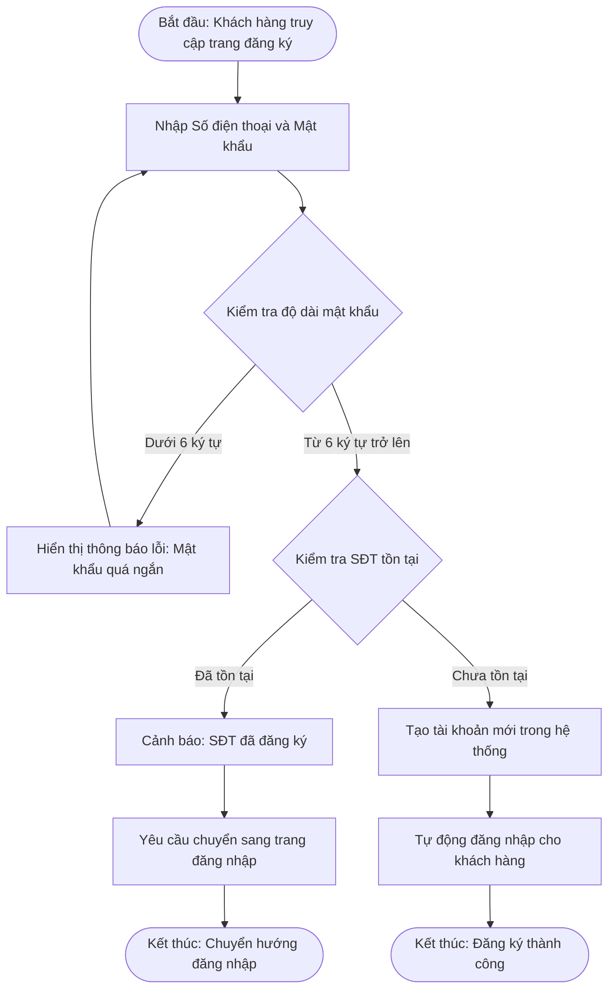
```mermaid
flowchart TD
    A([Bắt đầu: Khách hàng truy cập trang đăng ký]) --> B[Nhập Số điện thoại và Mật khẩu]
    B --> C{Kiểm tra độ dài mật khẩu}
    C -- Dưới 6 ký tự --> D[Hiển thị thông báo lỗi: Mật khẩu quá ngắn]
    D --> B
    C -- "Từ 6 ký tự trở lên" --> E{Kiểm tra SĐT tồn tại}
    E -- "Đã tồn tại" --> F[Cảnh báo: SĐT đã đăng ký]
    F --> G[Yêu cầu chuyển sang trang đăng nhập]
    E -- "Chưa tồn tại" --> H[Tạo tài khoản mới trong hệ thống]
    H --> I[Tự động đăng nhập cho khách hàng]
    I --> Z([Kết thúc: Đăng ký thành công])
    G --> Z2([Kết thúc: Chuyển hướng đăng nhập])
```

**Mô tả điểm rẽ nhánh:**
- **Kiểm tra độ dài mật khẩu:** Nếu mật khẩu dưới 6 ký tự, hệ thống chặn đăng ký và yêu cầu nhập lại (Error).
- **Kiểm tra SĐT tồn tại:** Nếu SĐT đã được sử dụng, hệ thống cảnh báo và hướng dẫn khách hàng đăng nhập thay vì tạo mới (Edge Case). Nếu SĐT chưa tồn tại và hợp lệ, hệ thống tiến hành tạo tài khoản và tự động đăng nhập (Happy Path).

---

### 2. User Flow: Đăng nhập đa vai trò
- **User Story:** `UM-002`
- **Actor:** `User (Admin, Operator, Driver, Customer)`
- **Pre-conditions:** Người dùng có tài khoản trên hệ thống.

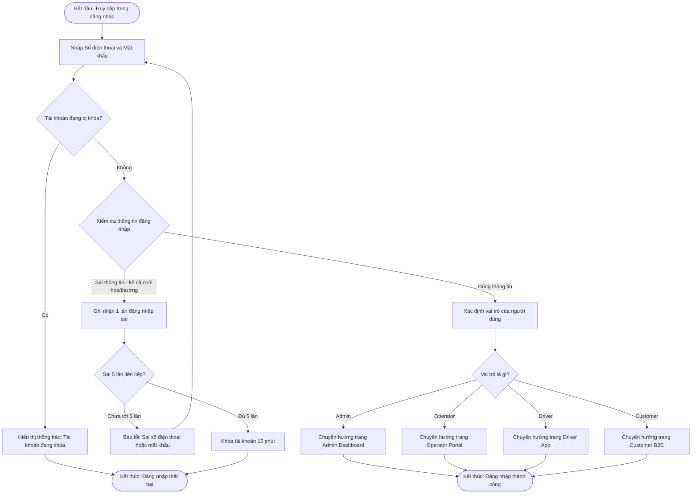
```mermaid
flowchart TD
    A([Bắt đầu: Truy cập trang đăng nhập]) --> B[Nhập Số điện thoại và Mật khẩu]
    B --> C{Tài khoản đang bị khóa?}
    C -- "Có" --> D[Hiển thị thông báo: Tài khoản đang khóa]
    D --> Z1([Kết thúc: Đăng nhập thất bại])
    C -- "Không" --> E{Kiểm tra thông tin đăng nhập}
    E -- "Sai thông tin - kể cả chữ hoa/thường" --> F[Ghi nhận 1 lần đăng nhập sai]
    F --> G{Sai 5 lần liên tiếp?}
    G -- "Chưa tới 5 lần" --> H[Báo lỗi: Sai số điện thoại hoặc mật khẩu]
    H --> B
    G -- "Đủ 5 lần" --> I[Khóa tài khoản 15 phút]
    I --> Z1
    E -- "Đúng thông tin" --> J[Xác định vai trò của người dùng]
    J --> K{Vai trò là gì?}
    K -- "Admin" --> L[Chuyển hướng trang Admin Dashboard]
    K -- "Operator" --> M[Chuyển hướng trang Operator Portal]
    K -- "Driver" --> N[Chuyển hướng trang Driver App]
    K -- "Customer" --> O[Chuyển hướng trang Customer B2C]
    L --> Z2([Kết thúc: Đăng nhập thành công])
    M --> Z2
    N --> Z2
    O --> Z2
```

**Mô tả điểm rẽ nhánh:**
- **Kiểm tra khóa tài khoản:** Tránh brute-force nếu tài khoản đã bị khóa trước đó.
- **Kiểm tra thông tin:** Phân biệt chữ hoa chữ thường. Nếu sai sẽ ghi nhận số lần sai (Edge Case).
- **Kiểm tra số lần sai:** Vượt quá 5 lần sẽ khóa tài khoản 15 phút (Error).
- **Xác định vai trò:** Chuyển hướng người dùng đến đúng giao diện dựa trên Role (Happy Path).

---

### 3. User Flow: Quản lý thông tin VAT khách sỉ
- **User Story:** `UM-003`
- **Actor:** `B2B Customer / Operator`
- **Pre-conditions:** Đã đăng nhập, truy cập phần cập nhật thông tin VAT.

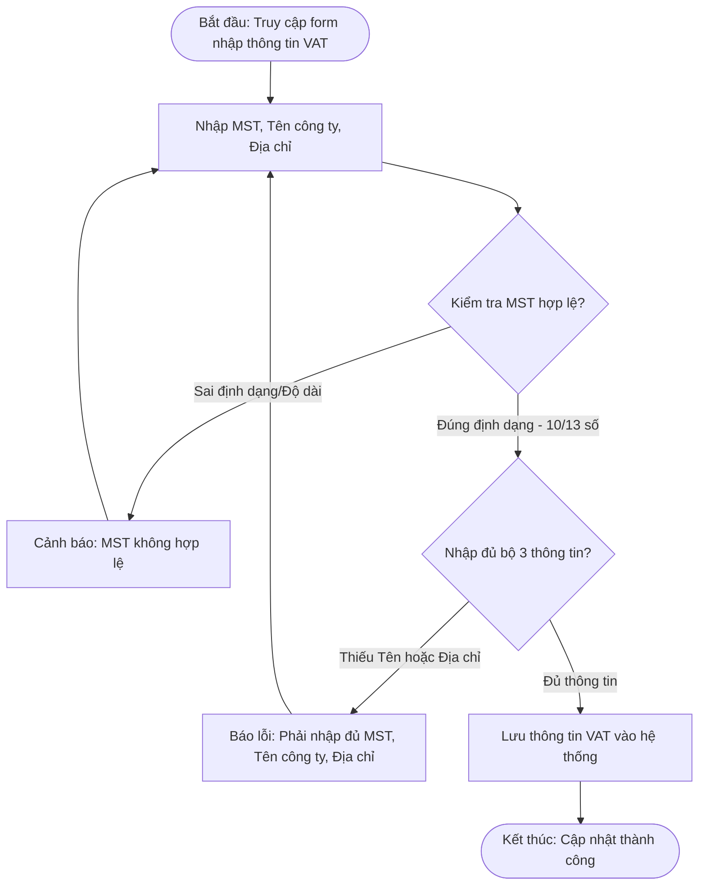
```mermaid
flowchart TD
    A([Bắt đầu: Truy cập form nhập thông tin VAT]) --> B[Nhập MST, Tên công ty, Địa chỉ]
    B --> C{Kiểm tra MST hợp lệ?}
    C -- "Sai định dạng/Độ dài" --> D[Cảnh báo: MST không hợp lệ]
    D --> B
    C -- "Đúng định dạng - 10/13 số" --> E{Nhập đủ bộ 3 thông tin?}
    E -- "Thiếu Tên hoặc Địa chỉ" --> F[Báo lỗi: Phải nhập đủ MST, Tên công ty, Địa chỉ]
    F --> B
    E -- "Đủ thông tin" --> G[Lưu thông tin VAT vào hệ thống]
    G --> Z([Kết thúc: Cập nhật thành công])
```

**Mô tả điểm rẽ nhánh:**
- **Kiểm tra MST:** Regex kiểm tra mã số thuế Việt Nam (10 hoặc 13 số). Nếu sai định dạng sẽ báo lỗi (Edge Case).
- **Kiểm tra tính đầy đủ:** Yêu cầu cả 3 trường MST, Tên công ty, Địa chỉ phải đi kèm với nhau. Không cho phép lưu nếu thiếu bất kỳ trường nào trong bộ 3 (Error). Nếu đủ, lưu thành công (Happy Path).

---

## EPIC 2: Customer Ordering (CO) — Đặt hàng Khách hàng

### 4. User Flow: Xem danh mục sản phẩm Shopee-like
- **User Story:** `CO-001`
- **Actor:** `Customer`
- **Pre-conditions:** Không yêu cầu đăng nhập.

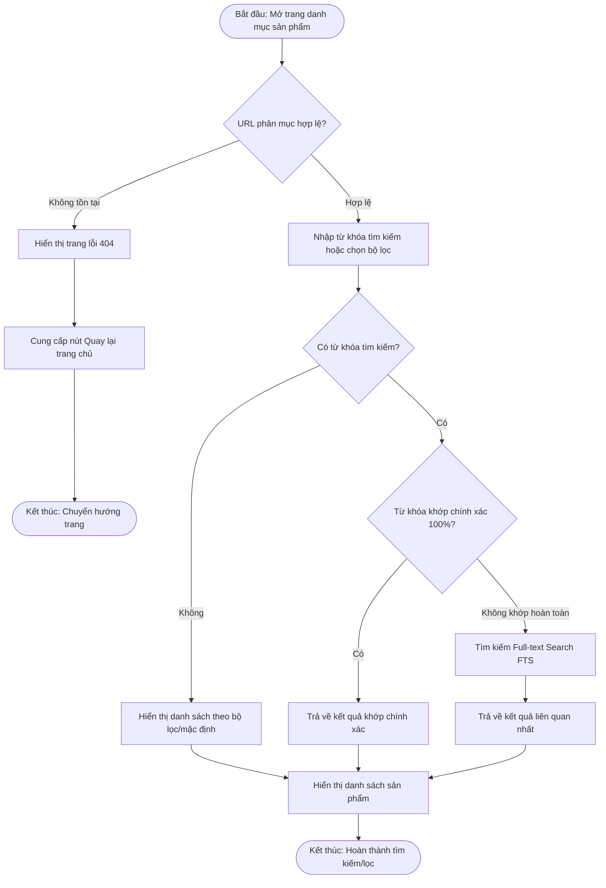
```mermaid
flowchart TD
    A([Bắt đầu: Mở trang danh mục sản phẩm]) --> B{URL phân mục hợp lệ?}
    B -- "Không tồn tại" --> C[Hiển thị trang lỗi 404]
    C --> D[Cung cấp nút Quay lại trang chủ]
    D --> Z1([Kết thúc: Chuyển hướng trang])
    B -- "Hợp lệ" --> E[Nhập từ khóa tìm kiếm hoặc chọn bộ lọc]
    E --> F{Có từ khóa tìm kiếm?}
    F -- "Không" --> G[Hiển thị danh sách theo bộ lọc/mặc định]
    F -- "Có" --> H{Từ khóa khớp chính xác 100%?}
    H -- "Có" --> I[Trả về kết quả khớp chính xác]
    H -- "Không khớp hoàn toàn" --> J[Tìm kiếm Full-text Search FTS]
    J --> K[Trả về kết quả liên quan nhất]
    G --> L[Hiển thị danh sách sản phẩm]
    I --> L
    K --> L
    L --> Z2([Kết thúc: Hoàn thành tìm kiếm/lọc])
```

**Mô tả điểm rẽ nhánh:**
- **Kiểm tra URL phân mục:** Đảm bảo xử lý lỗi khi khách truy cập link hỏng bằng trang 404 thân thiện (Error).
- **Tìm kiếm sản phẩm:** Khi khách hàng tìm kiếm với từ khóa không khớp 100% (ví dụ có lỗi chính tả hoặc từ khóa dài), hệ thống dùng FTS để tìm sản phẩm liên quan thay vì báo không tìm thấy (Edge Case). Nếu tìm chính xác sẽ ưu tiên hiển thị (Happy Path).

---

### 5. User Flow: Quản lý giỏ hàng & lựa chọn vỏ đối lưu
- **User Story:** `CO-002`
- **Actor:** `Customer`
- **Pre-conditions:** Khách hàng đang có sản phẩm (bình gas) trong giỏ hàng.

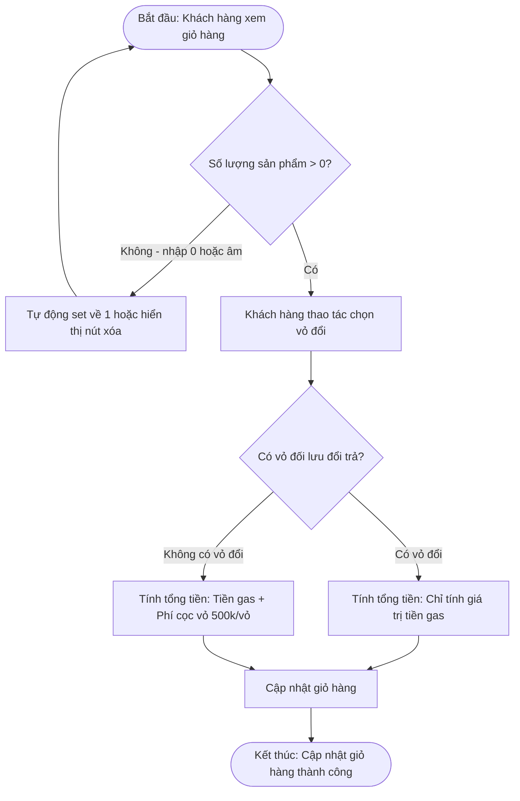
```mermaid
flowchart TD
    A([Bắt đầu: Khách hàng xem giỏ hàng]) --> B{Số lượng sản phẩm > 0?}
    B -- "Không - nhập 0 hoặc âm" --> C[Tự động set về 1 hoặc hiển thị nút xóa]
    C --> A
    B -- "Có" --> D[Khách hàng thao tác chọn vỏ đổi]
    D --> E{Có vỏ đối lưu đổi trả?}
    E -- "Có vỏ đổi" --> F[Tính tổng tiền: Chỉ tính giá trị tiền gas]
    E -- "Không có vỏ đổi" --> G[Tính tổng tiền: Tiền gas + Phí cọc vỏ 500k/vỏ]
    F --> H[Cập nhật giỏ hàng]
    G --> H
    H --> Z([Kết thúc: Cập nhật giỏ hàng thành công])
```

**Mô tả điểm rẽ nhánh:**
- **Số lượng sản phẩm:** Chặn trường hợp nhập số âm hoặc 0 vào số lượng giỏ hàng bằng cách reset về 1 hoặc gỡ bỏ (Error).
- **Lựa chọn vỏ đối lưu:** Đây là nghiệp vụ đặc thù của ngành gas. Nếu khách chọn có vỏ đổi thì tổng tiền chỉ gồm tiền gas (Happy Path). Nếu mua mới hoàn toàn không có vỏ, hệ thống tự động cộng thêm phí cọc vỏ mặc định (Edge Case).

---

### 6. User Flow: Thanh toán và chọn phương thức
- **User Story:** `CO-003`
- **Actor:** `Customer`
- **Pre-conditions:** Đã chọn sản phẩm và tiến hành Checkout.

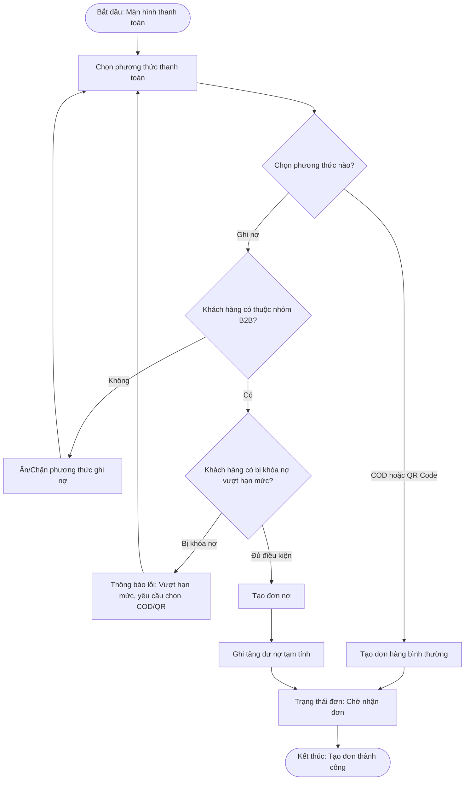
```mermaid
flowchart TD
    A([Bắt đầu: Màn hình thanh toán]) --> B[Chọn phương thức thanh toán]
    B --> C{Chọn phương thức nào?}
    C -- "COD hoặc QR Code" --> D[Tạo đơn hàng bình thường]
    D --> E[Trạng thái đơn: Chờ nhận đơn]
    E --> Z1([Kết thúc: Tạo đơn thành công])
    C -- "Ghi nợ" --> F{Khách hàng có thuộc nhóm B2B?}
    F -- "Không" --> G[Ẩn/Chặn phương thức ghi nợ]
    G --> B
    F -- "Có" --> H{Khách hàng có bị khóa nợ vượt hạn mức?}
    H -- "Bị khóa nợ" --> I[Thông báo lỗi: Vượt hạn mức, yêu cầu chọn COD/QR]
    I --> B
    H -- "Đủ điều kiện" --> J[Tạo đơn nợ]
    J --> K[Ghi tăng dư nợ tạm tính]
    K --> E
```

**Mô tả điểm rẽ nhánh:**
- **Khách thường chọn COD/QR:** Tiến trình chuẩn, đơn hàng được tạo và chờ xử lý (Happy Path).
- **Kiểm tra quyền ghi nợ:** Chỉ khách B2B mới được phép ghi nợ (Edge Case).
- **Kiểm tra hạn mức nợ:** Nếu khách B2B đã vượt hạn mức công nợ, hệ thống chặn tạo đơn nợ và buộc phải chuyển sang thanh toán tiền mặt/chuyển khoản để tránh rủi ro (Error).

---

### 7. User Flow: Khóa đơn giá bán tại thời điểm đặt hàng
- **User Story:** `CO-004`
- **Actor:** `Customer / Operator / Admin`
- **Pre-conditions:** Đơn hàng đã được tạo.

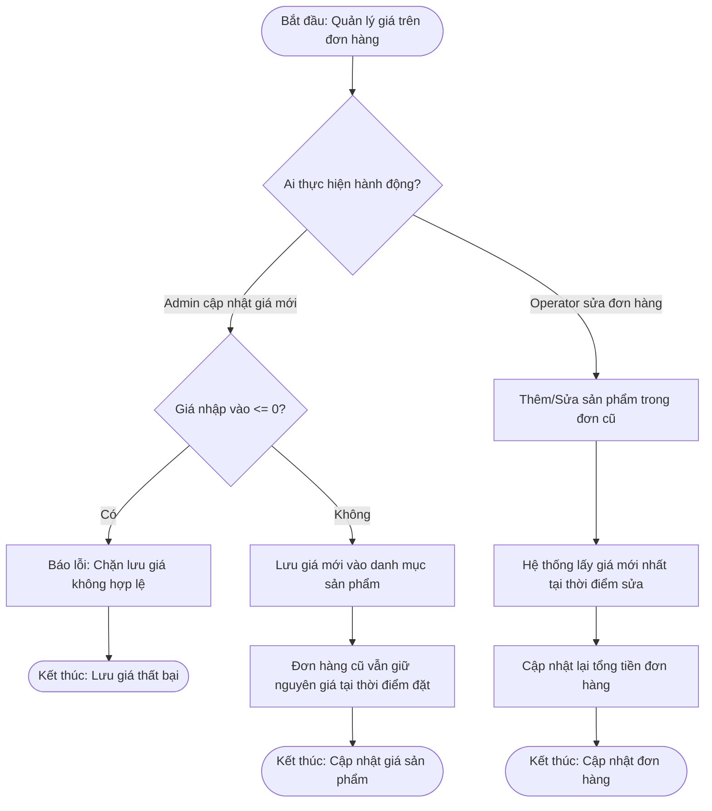
```mermaid
flowchart TD
    A([Bắt đầu: Quản lý giá trên đơn hàng]) --> B{Ai thực hiện hành động?}
    B -- "Admin cập nhật giá mới" --> C{Giá nhập vào <= 0?}
    C -- "Có" --> D[Báo lỗi: Chặn lưu giá không hợp lệ]
    D --> Z1([Kết thúc: Lưu giá thất bại])
    C -- "Không" --> E[Lưu giá mới vào danh mục sản phẩm]
    E --> F[Đơn hàng cũ vẫn giữ nguyên giá tại thời điểm đặt]
    F --> Z2([Kết thúc: Cập nhật giá sản phẩm])
    B -- "Operator sửa đơn hàng" --> G[Thêm/Sửa sản phẩm trong đơn cũ]
    G --> H[Hệ thống lấy giá mới nhất tại thời điểm sửa]
    H --> I[Cập nhật lại tổng tiền đơn hàng]
    I --> Z3([Kết thúc: Cập nhật đơn hàng])
```

**Mô tả điểm rẽ nhánh:**
- **Admin đổi giá:** Đảm bảo giá trị sản phẩm hợp lệ (>0) (Error). Các đơn hàng đã đặt trước đó phải bảo toàn giá lịch sử để tránh sai lệch công nợ (Happy Path).
- **Operator sửa đơn:** Nếu tổng đài viên thêm sản phẩm vào đơn cũ, sản phẩm thêm mới sẽ áp dụng giá của thời điểm hiện tại (lúc sửa) chứ không phải lúc tạo đơn (Edge Case).

---

### 8. User Flow: Theo dõi trạng thái đơn hàng
- **User Story:** `CO-005`
- **Actor:** `Customer`
- **Pre-conditions:** Khách hàng xem chi tiết đơn hàng của mình.

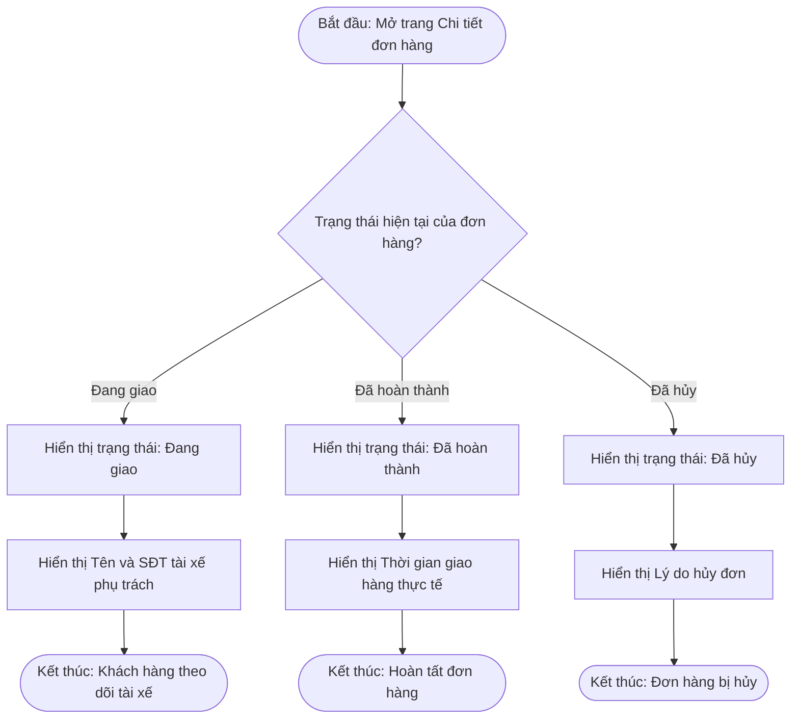
```mermaid
flowchart TD
    A([Bắt đầu: Mở trang Chi tiết đơn hàng]) --> B{Trạng thái hiện tại của đơn hàng?}
    B -- "Đang giao" --> C[Hiển thị trạng thái: Đang giao]
    C --> D[Hiển thị Tên và SĐT tài xế phụ trách]
    D --> Z1([Kết thúc: Khách hàng theo dõi tài xế])
    B -- "Đã hoàn thành" --> E[Hiển thị trạng thái: Đã hoàn thành]
    E --> F[Hiển thị Thời gian giao hàng thực tế]
    F --> Z2([Kết thúc: Hoàn tất đơn hàng])
    B -- "Đã hủy" --> G[Hiển thị trạng thái: Đã hủy]
    G --> H[Hiển thị Lý do hủy đơn]
    H --> Z3([Kết thúc: Đơn hàng bị hủy])
```

**Mô tả điểm rẽ nhánh:**
- **Đang giao:** Không tích hợp map tracking real-time để tiết kiệm chi phí/phức tạp, chỉ cần hiện thông tin liên hệ của Driver để khách tự gọi khi cần (Happy Path).
- **Hoàn thành:** Cung cấp thông tin thời gian thực tế để đối soát (Edge Case).
- **Hủy đơn:** Bắt buộc hiển thị lý do (do khách hủy, hết hàng, hoặc lý do từ tổng đài) để khách hiểu nguyên nhân (Error).

---

## EPIC 3: Operator Ordering (OP) — Nhân viên Tổng đài Lên đơn

### 9. User Flow: Nhân viên tổng đài lên đơn qua điện thoại
- **User Story:** `OP-001`
- **Actor:** `Operator (Nhân viên tổng đài)`
- **Pre-conditions:** Đang trong ca trực trên Web Operator Portal.

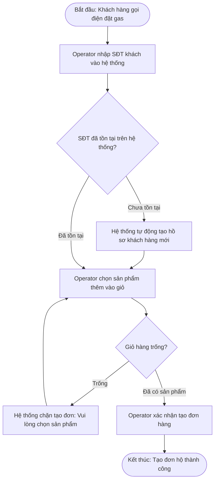
```mermaid
flowchart TD
    A([Bắt đầu: Khách hàng gọi điện đặt gas]) --> B[Operator nhập SĐT khách vào hệ thống]
    B --> C{SĐT đã tồn tại trên hệ thống?}
    C -- "Chưa tồn tại" --> D[Hệ thống tự động tạo hồ sơ khách hàng mới]
    D --> E[Operator chọn sản phẩm thêm vào giỏ]
    C -- "Đã tồn tại" --> E
    E --> F{Giỏ hàng trống?}
    F -- "Trống" --> G[Hệ thống chặn tạo đơn: Vui lòng chọn sản phẩm]
    G --> E
    F -- "Đã có sản phẩm" --> H[Operator xác nhận tạo đơn hàng]
    H --> Z([Kết thúc: Tạo đơn hộ thành công])
```

**Mô tả điểm rẽ nhánh:**
- **Khách hàng cũ (SĐT đã tồn tại):** Tự động load thông tin địa chỉ cũ để tiến hành chọn SP (Happy Path).
- **Khách hàng mới:** Để quy trình nhanh, Operator không cần ra trang khác tạo user mà hệ thống ngầm tự tạo hồ sơ khách hàng dựa trên SĐT vừa nhập (Edge Case).
- **Kiểm tra giỏ hàng:** Nếu vô tình bấm Lưu mà chưa có sản phẩm, hệ thống bắt buộc chặn để tránh tạo đơn rác (Error).

---

### 10. User Flow: Kiểm tra khoảng cách giao hàng tự động
- **User Story:** `OP-002`
- **Actor:** `Operator`
- **Pre-conditions:** Operator đang tạo hoặc sửa địa chỉ giao hàng của đơn.

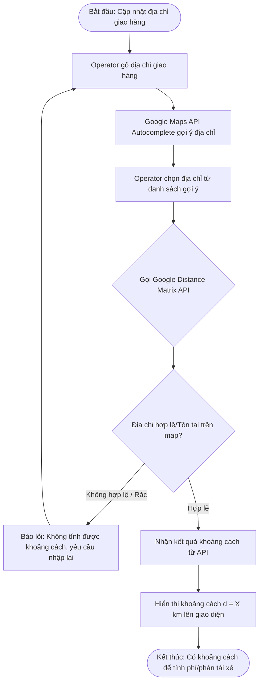
```mermaid
flowchart TD
    A([Bắt đầu: Cập nhật địa chỉ giao hàng]) --> B[Operator gõ địa chỉ giao hàng]
    B --> C[Google Maps API Autocomplete gợi ý địa chỉ]
    C --> D[Operator chọn địa chỉ từ danh sách gợi ý]
    D --> E{Gọi Google Distance Matrix API}
    E --> F{Địa chỉ hợp lệ/Tồn tại trên map?}
    F -- "Không hợp lệ / Rác" --> G[Báo lỗi: Không tính được khoảng cách, yêu cầu nhập lại]
    G --> B
    F -- "Hợp lệ" --> H[Nhận kết quả khoảng cách từ API]
    H --> I[Hiển thị khoảng cách d = X km lên giao diện]
    I --> Z([Kết thúc: Có khoảng cách để tính phí/phân tài xế])
```

**Mô tả điểm rẽ nhánh:**
- **Sử dụng Autocomplete:** Giúp hạn chế nhập sai địa chỉ và chuẩn hóa dữ liệu đầu vào (Edge Case).
- **Địa chỉ hợp lệ:** Trả về kết quả khoảng cách chính xác, làm cơ sở tính phí ship hoặc phân cuốc (Happy Path).
- **Địa chỉ rác:** Tránh lỗi sập API hoặc sai logic, hệ thống bắt lỗi nếu không trả về tọa độ/khoảng cách và yêu cầu nhập lại rõ ràng (Error).

---

## EPIC 4: Smart Dispatching (SD) — Phân phối Đơn hàng Thông minh

### 11. User Flow: Chợ đơn dành cho tài xế
- **User Story:** `SD-001`
- **Actor:** `Tài xế (Driver)`
- **Pre-conditions:** Tài xế đã đăng nhập vào App Driver.

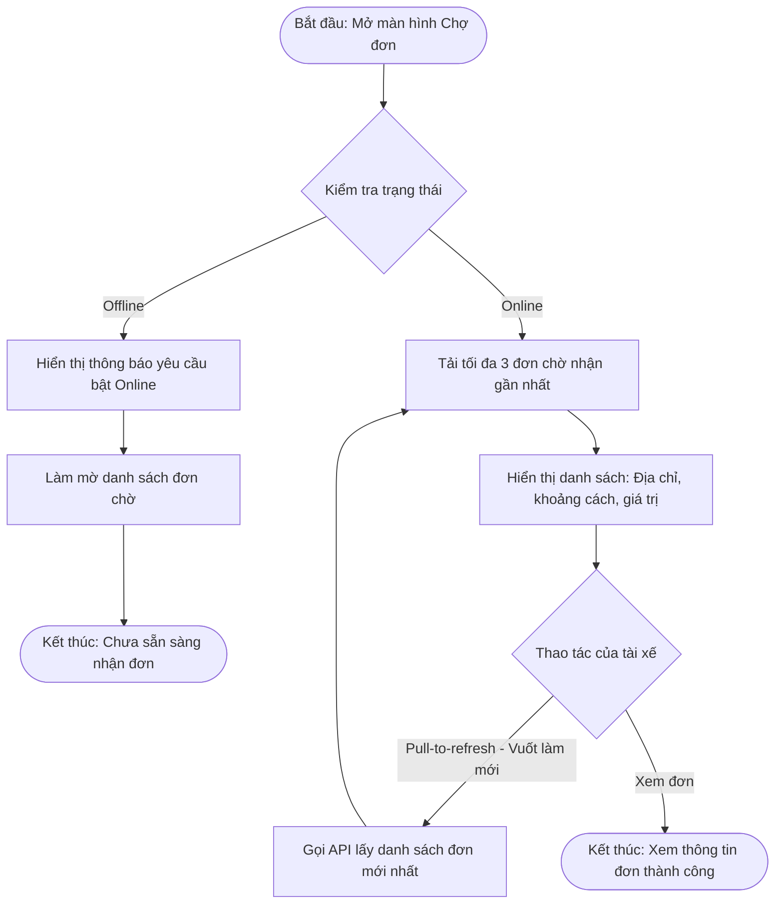
```mermaid
flowchart TD
    A([Bắt đầu: Mở màn hình Chợ đơn]) --> B{Kiểm tra trạng thái}
    B -- Offline --> C[Hiển thị thông báo yêu cầu bật Online]
    C --> D[Làm mờ danh sách đơn chờ]
    D --> E([Kết thúc: Chưa sẵn sàng nhận đơn])
    B -- Online --> F[Tải tối đa 3 đơn chờ nhận gần nhất]
    F --> G[Hiển thị danh sách: Địa chỉ, khoảng cách, giá trị]
    G --> H{Thao tác của tài xế}
    H -- "Pull-to-refresh - Vuốt làm mới" --> I[Gọi API lấy danh sách đơn mới nhất]
    I --> F
    H -- "Xem đơn" --> J([Kết thúc: Xem thông tin đơn thành công])
```

**Mô tả điểm rẽ nhánh:**
- **Kiểm tra trạng thái:** Hệ thống yêu cầu tài xế phải Online để xem chi tiết đơn. Nếu Offline, danh sách bị mờ và có thông báo nhắc nhở (Error).
- **Thao tác của tài xế:** Tài xế có thể vuốt để làm mới danh sách (Edge Case), hệ thống sẽ cập nhật lại danh sách các đơn hàng hiện có trên hệ thống, ưu tiên 3 đơn. Nếu tài xế chỉ xem (Happy Path) thì quy trình kết thúc.

---

### 12. User Flow: Giật đơn giao hàng Grab-style
- **User Story:** `SD-002`
- **Actor:** `Tài xế (Driver)`
- **Pre-conditions:** Tài xế đang Online, đang ở màn hình Chợ đơn và có đơn hàng chờ.

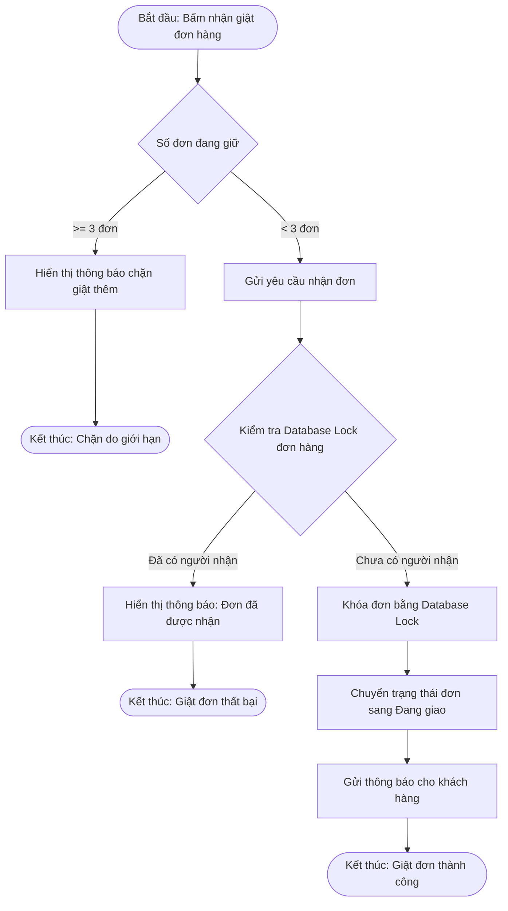
```mermaid
flowchart TD
    A([Bắt đầu: Bấm nhận giật đơn hàng]) --> B{Số đơn đang giữ}
    B -- ">= 3 đơn" --> C[Hiển thị thông báo chặn giật thêm]
    C --> D([Kết thúc: Chặn do giới hạn])
    B -- "< 3 đơn" --> E[Gửi yêu cầu nhận đơn]
    E --> F{Kiểm tra Database Lock đơn hàng}
    F -- Đã có người nhận --> G[Hiển thị thông báo: Đơn đã được nhận]
    G --> H([Kết thúc: Giật đơn thất bại])
    F -- Chưa có người nhận --> I[Khóa đơn bằng Database Lock]
    I --> J[Chuyển trạng thái đơn sang Đang giao]
    J --> K[Gửi thông báo cho khách hàng]
    K --> L([Kết thúc: Giật đơn thành công])
```

**Mô tả điểm rẽ nhánh:**
- **Số đơn đang giữ:** Tài xế chỉ được giữ tối đa 3 đơn cùng lúc. Nếu vượt quá (Error), hệ thống chặn thao tác.
- **Kiểm tra Database Lock:** Để xử lý tranh chấp khi 2 tài xế cùng giật (Edge Case), hệ thống kiểm tra lock. Tài xế chậm hơn nhận thông báo đơn đã có chủ. Tài xế nhanh nhất sẽ khóa đơn thành công (Happy Path).

---

### 13. User Flow: Báo cáo sự cố hỏng xe dọc đường
- **User Story:** `SD-003`
- **Actor:** `Tài xế (Driver)`
- **Pre-conditions:** Tài xế đang giao đơn hàng.

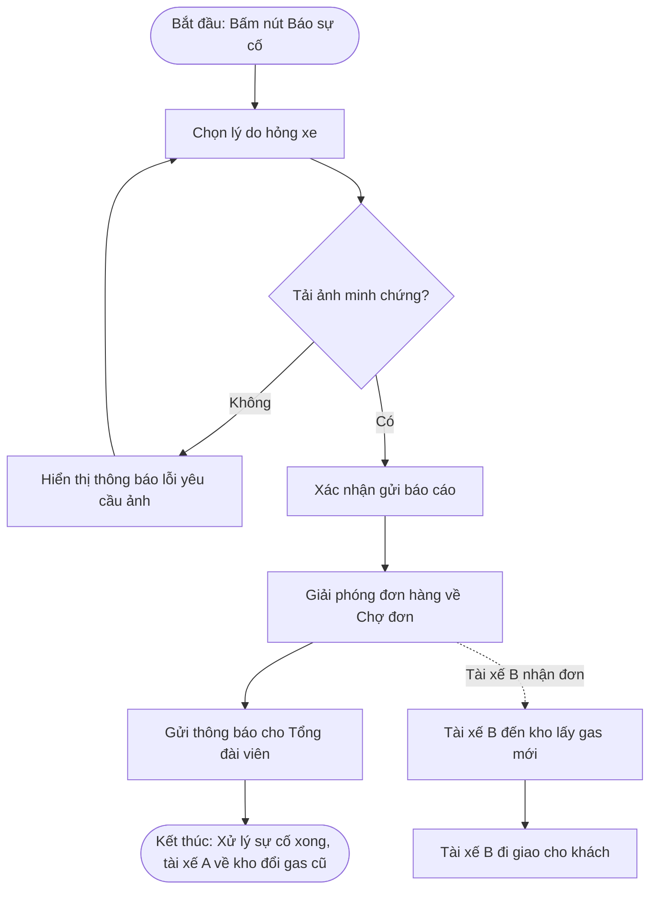
```mermaid
flowchart TD
    A([Bắt đầu: Bấm nút Báo sự cố]) --> B[Chọn lý do hỏng xe]
    B --> C{Tải ảnh minh chứng?}
    C -- Không --> D[Hiển thị thông báo lỗi yêu cầu ảnh]
    D --> B
    C -- Có --> E[Xác nhận gửi báo cáo]
    E --> F[Giải phóng đơn hàng về Chợ đơn]
    F --> G[Gửi thông báo cho Tổng đài viên]
    G --> H([Kết thúc: Xử lý sự cố xong, tài xế A về kho đổi gas cũ])
    F -. "Tài xế B nhận đơn" .-> I[Tài xế B đến kho lấy gas mới]
    I --> J[Tài xế B đi giao cho khách]
```

**Mô tả điểm rẽ nhánh:**
- **Tải ảnh minh chứng:** Bắt buộc tài xế phải tải ảnh (Error) để tránh báo cáo khống.
- **Sau khi giải phóng:** Đơn quay lại chợ (Happy Path). Nếu tài xế khác (B) nhận đơn này, họ phải về kho lấy bình gas mới chứ không lấy từ xe hỏng (Edge Case).

---

### 14. User Flow: Tổng đài gán đơn trôi & Phạt tài xế từ chối
- **User Story:** `SD-004`
- **Actor:** `Tổng đài viên (Operator), Tài xế (Driver)`
- **Pre-conditions:** Có đơn hàng trôi quá T_ORDER_TIMEOUT (VD: 15 phút).

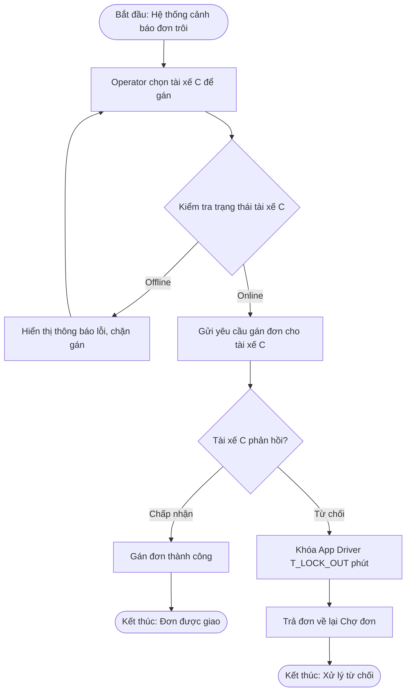
```mermaid
flowchart TD
    A([Bắt đầu: Hệ thống cảnh báo đơn trôi]) --> B[Operator chọn tài xế C để gán]
    B --> C{Kiểm tra trạng thái tài xế C}
    C -- Offline --> D[Hiển thị thông báo lỗi, chặn gán]
    D --> B
    C -- Online --> E[Gửi yêu cầu gán đơn cho tài xế C]
    E --> F{Tài xế C phản hồi?}
    F -- "Chấp nhận" --> G[Gán đơn thành công]
    G --> H([Kết thúc: Đơn được giao])
    F -- "Từ chối" --> I[Khóa App Driver T_LOCK_OUT phút]
    I --> J[Trả đơn về lại Chợ đơn]
    J --> K([Kết thúc: Xử lý từ chối])
```

**Mô tả điểm rẽ nhánh:**
- **Kiểm tra trạng thái tài xế C:** Operator chỉ có thể gán cho tài xế Online. Nếu Offline, hệ thống chặn (Error).
- **Tài xế C phản hồi:** Nếu đồng ý, đơn được xử lý (Happy Path). Nếu từ chối, tài xế bị phạt khóa app một thời gian quy định, đơn trở về chợ (Edge Case).

---

### 15. User Flow: Hủy đơn hàng đang giao & Đền bù công tài xế
- **User Story:** `SD-005`
- **Actor:** `Tổng đài viên (Operator), Tài xế (Driver)`
- **Pre-conditions:** Khách gọi Hotline yêu cầu hủy đơn hàng.

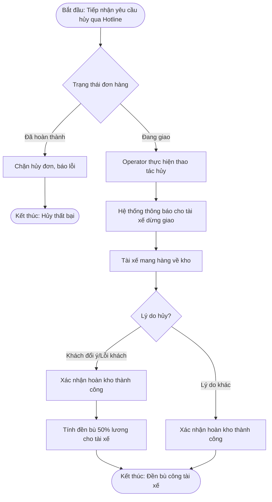
```mermaid
flowchart TD
    A([Bắt đầu: Tiếp nhận yêu cầu hủy qua Hotline]) --> B{Trạng thái đơn hàng}
    B -- "Đã hoàn thành" --> C[Chặn hủy đơn, báo lỗi]
    C --> D([Kết thúc: Hủy thất bại])
    B -- "Đang giao" --> E[Operator thực hiện thao tác hủy]
    E --> F[Hệ thống thông báo cho tài xế dừng giao]
    F --> G[Tài xế mang hàng về kho]
    G --> H{Lý do hủy?}
    H -- "Khách đổi ý/Lỗi khách" --> I[Xác nhận hoàn kho thành công]
    I --> J[Tính đền bù 50% lương cho tài xế]
    J --> K([Kết thúc: Đền bù công tài xế])
    H -- "Lý do khác" --> L[Xác nhận hoàn kho thành công]
    L --> K
```

**Mô tả điểm rẽ nhánh:**
- **Trạng thái đơn hàng:** Không cho phép hủy đơn đã giao xong (Error).
- **Lý do hủy:** Nếu là lỗi do khách, tài xế vẫn được hưởng đền bù 50% phí giao hàng (Edge Case). Nếu lý do thông thường, quy trình hoàn kho diễn ra bình thường (Happy Path).

---

## EPIC 5: Credit & Debt (CD) — Quản lý Công nợ

### 16. User Flow: Tự động xét duyệt điều kiện ghi nợ khách hàng
- **User Story:** `CD-001`
- **Actor:** `Khách hàng (Customer)`
- **Pre-conditions:** Khách hàng tiến hành đặt hàng hoặc xem thông tin tài khoản.

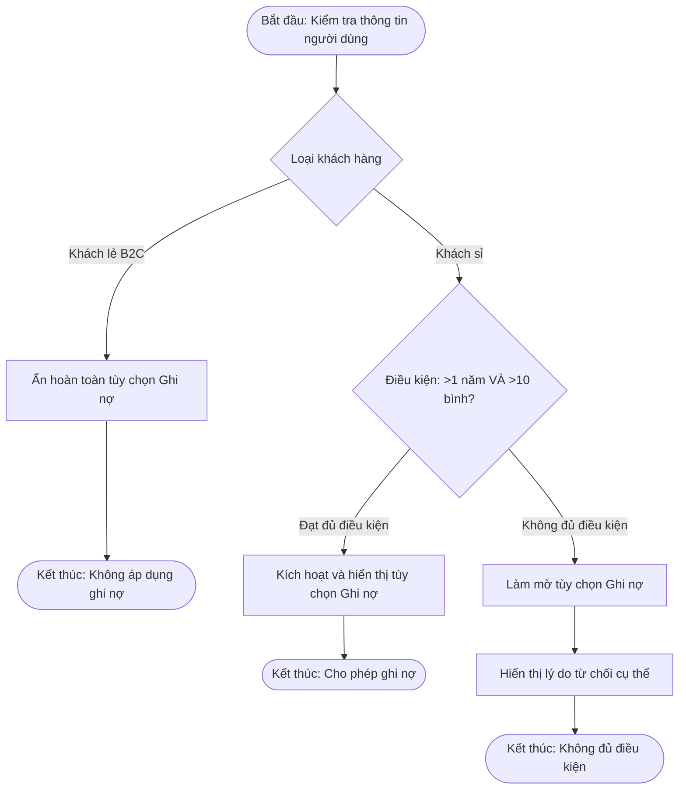
```mermaid
flowchart TD
    A([Bắt đầu: Kiểm tra thông tin người dùng]) --> B{Loại khách hàng}
    B -- "Khách lẻ B2C" --> C[Ẩn hoàn toàn tùy chọn Ghi nợ]
    C --> D([Kết thúc: Không áp dụng ghi nợ])
    B -- "Khách sỉ" --> E{Điều kiện: >1 năm VÀ >10 bình?}
    E -- "Đạt đủ điều kiện" --> F[Kích hoạt và hiển thị tùy chọn Ghi nợ]
    F --> G([Kết thúc: Cho phép ghi nợ])
    E -- "Không đủ điều kiện" --> H[Làm mờ tùy chọn Ghi nợ]
    H --> I[Hiển thị lý do từ chối cụ thể]
    I --> J([Kết thúc: Không đủ điều kiện])
```

**Mô tả điểm rẽ nhánh:**
- **Loại khách hàng:** Khách lẻ không có chính sách ghi nợ (Error).
- **Điều kiện khách sỉ:** Nếu thỏa mãn đủ cả thời gian và sản lượng thì mở tính năng (Happy Path). Nếu thiếu 1 trong 2 thì làm mờ và giải thích rõ ràng (Edge Case).

---

### 17. User Flow: Khóa nợ tự động khi vượt hạn mức hoặc quá hạn
- **User Story:** `CD-002`
- **Actor:** `Hệ thống (System), Admin`
- **Pre-conditions:** Khách hàng đang có dư nợ và thực hiện đặt đơn mới hoặc API kiểm tra nợ chạy định kỳ.

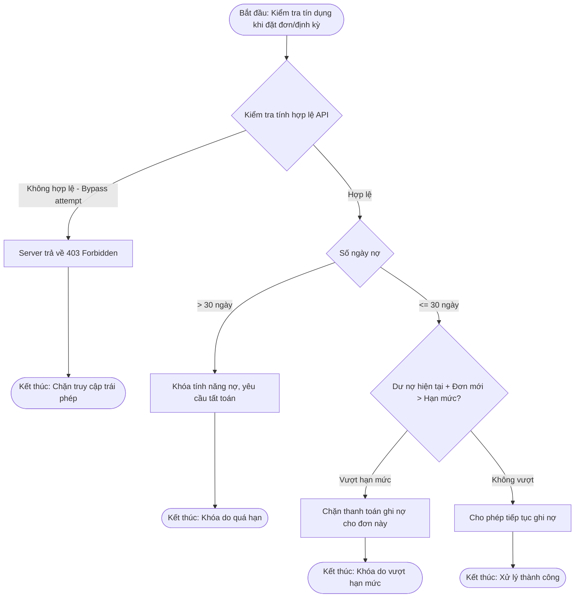
```mermaid
flowchart TD
    A([Bắt đầu: Kiểm tra tín dụng khi đặt đơn/định kỳ]) --> B{Kiểm tra tính hợp lệ API}
    B -- "Không hợp lệ - Bypass attempt" --> C[Server trả về 403 Forbidden]
    C --> D([Kết thúc: Chặn truy cập trái phép])
    B -- "Hợp lệ" --> E{Số ngày nợ}
    E -- "> 30 ngày" --> F[Khóa tính năng nợ, yêu cầu tất toán]
    F --> G([Kết thúc: Khóa do quá hạn])
    E -- "<= 30 ngày" --> H{Dư nợ hiện tại + Đơn mới > Hạn mức?}
    H -- "Vượt hạn mức" --> I[Chặn thanh toán ghi nợ cho đơn này]
    I --> J([Kết thúc: Khóa do vượt hạn mức])
    H -- "Không vượt" --> K[Cho phép tiếp tục ghi nợ]
    K --> L([Kết thúc: Xử lý thành công])
```

**Mô tả điểm rẽ nhánh:**
- **Tính hợp lệ API:** Bất kỳ nỗ lực bypass nào cũng bị chặn ở cấp server (Error).
- **Số ngày nợ:** Nợ lâu hơn quy định sẽ bị khóa ngay lập tức (Edge Case).
- **Hạn mức nợ:** Nếu cộng dồn vượt ngưỡng thì đơn hàng không được ghi nợ tiếp (Happy Path khóa nợ).

---

### 18. User Flow: Tạo mã VietQR động thanh toán nợ & Luồng dự phòng
- **User Story:** `CD-003`
- **Actor:** `Khách hàng (Customer), Tài xế (Driver)`
- **Pre-conditions:** Khách hàng muốn thanh toán nợ / thanh toán tiền khi nhận hàng.

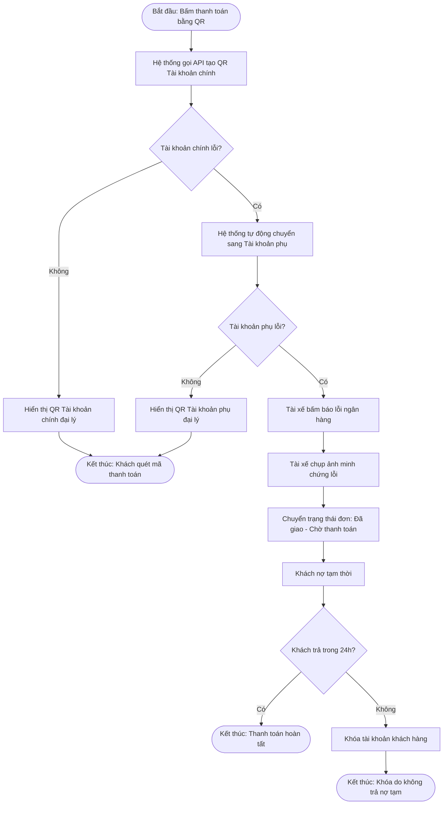
```mermaid
flowchart TD
    A([Bắt đầu: Bấm thanh toán bằng QR]) --> B[Hệ thống gọi API tạo QR Tài khoản chính]
    B --> C{Tài khoản chính lỗi?}
    C -- Không --> D[Hiển thị QR Tài khoản chính đại lý]
    D --> E([Kết thúc: Khách quét mã thanh toán])
    C -- Có --> F[Hệ thống tự động chuyển sang Tài khoản phụ]
    F --> G{Tài khoản phụ lỗi?}
    G -- Không --> H[Hiển thị QR Tài khoản phụ đại lý]
    H --> E
    G -- Có --> I[Tài xế bấm báo lỗi ngân hàng]
    I --> J[Tài xế chụp ảnh minh chứng lỗi]
    J --> K[Chuyển trạng thái đơn: Đã giao - Chờ thanh toán]
    K --> L[Khách nợ tạm thời]
    L --> M{Khách trả trong 24h?}
    M -- Có --> N([Kết thúc: Thanh toán hoàn tất])
    M -- Không --> O[Khóa tài khoản khách hàng]
    O --> P([Kết thúc: Khóa do không trả nợ tạm])
```

**Mô tả điểm rẽ nhánh:**
- **Tài khoản chính lỗi:** Hệ thống fallback sang tài khoản phụ (Edge Case). Tài khoản QR sinh ra luôn là của Đại lý, **TUYỆT ĐỐI** không dùng QR tài xế.
- **Tài khoản phụ cũng lỗi:** Khi không thể tạo QR và khách không có tiền mặt (Pending Payment Edge Case), tài xế thao tác báo lỗi. Hệ thống ghi nợ tạm 24h, nếu không xử lý sẽ bị khóa (Error flow handling).

---

### 19. User Flow: Tin nhắn nhắc nợ và chống spam đặt/hủy đơn
- **User Story:** `CD-004`
- **Actor:** `Hệ thống (System), Admin`
- **Pre-conditions:** Khách hàng có nợ quá hạn hoặc có hành vi đặt/hủy bất thường.

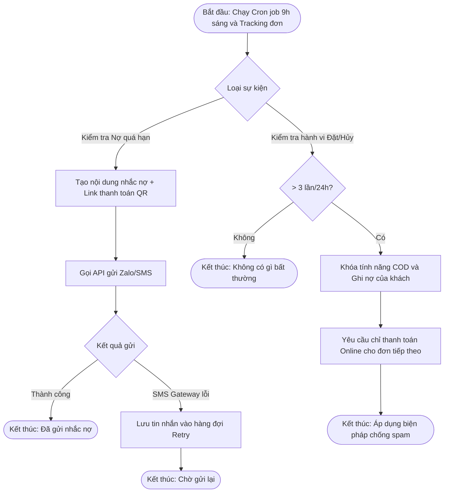
```mermaid
flowchart TD
    A([Bắt đầu: Chạy Cron job 9h sáng và Tracking đơn]) --> B{Loại sự kiện}
    B -- "Kiểm tra Nợ quá hạn" --> C[Tạo nội dung nhắc nợ + Link thanh toán QR]
    C --> D[Gọi API gửi Zalo/SMS]
    D --> E{Kết quả gửi}
    E -- "Thành công" --> F([Kết thúc: Đã gửi nhắc nợ])
    E -- "SMS Gateway lỗi" --> G[Lưu tin nhắn vào hàng đợi Retry]
    G --> H([Kết thúc: Chờ gửi lại])
    B -- "Kiểm tra hành vi Đặt/Hủy" --> I{> 3 lần/24h?}
    I -- Không --> J([Kết thúc: Không có gì bất thường])
    I -- Có --> K[Khóa tính năng COD và Ghi nợ của khách]
    K --> L[Yêu cầu chỉ thanh toán Online cho đơn tiếp theo]
    L --> M([Kết thúc: Áp dụng biện pháp chống spam])
```

**Mô tả điểm rẽ nhánh:**
- **Gửi tin nhắc nợ:** Hoạt động thường quy (Happy Path). Nếu đối tác SMS lỗi, hệ thống phải lưu retry thay vì bỏ qua (Error).
- **Hành vi Đặt/Hủy:** Phát hiện lạm dụng (Edge Case), hệ thống lập tức cắt các phương thức thanh toán rủi ro để bảo vệ đại lý.

---

### 20. User Flow: Quản lý công nợ gối đầu với Nhà sản xuất
- **User Story:** `CD-005`
- **Actor:** `Admin`
- **Pre-conditions:** Admin tạo phiếu nhập kho từ Nhà sản xuất.

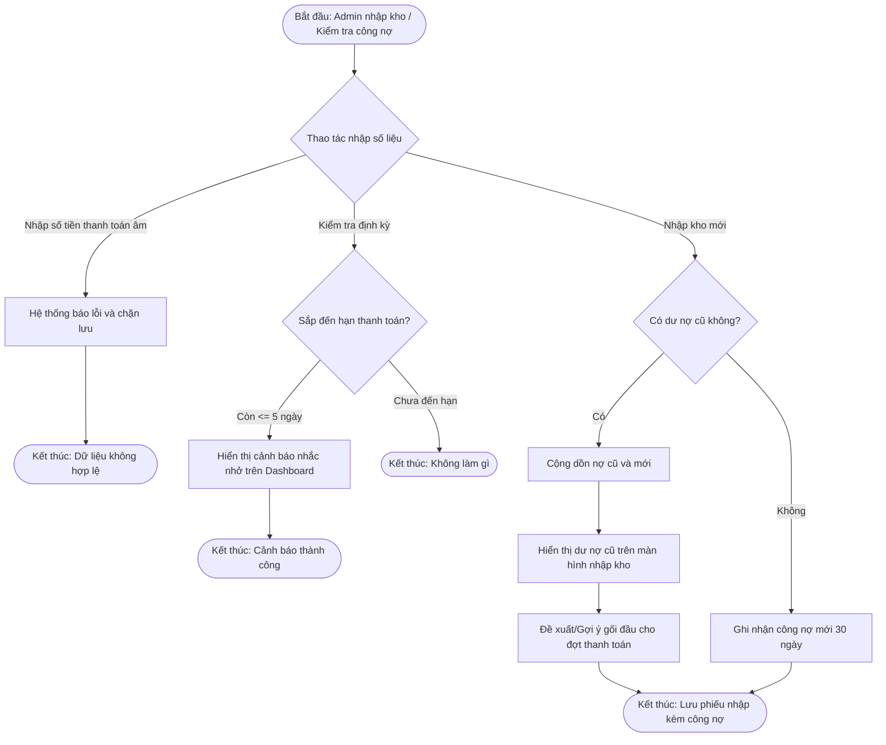
```mermaid
flowchart TD
    A([Bắt đầu: Admin nhập kho / Kiểm tra công nợ]) --> B{Thao tác nhập số liệu}
    B -- "Nhập số tiền thanh toán âm" --> C[Hệ thống báo lỗi và chặn lưu]
    C --> D([Kết thúc: Dữ liệu không hợp lệ])
    B -- "Kiểm tra định kỳ" --> E{Sắp đến hạn thanh toán?}
    E -- "Còn <= 5 ngày" --> F[Hiển thị cảnh báo nhắc nhở trên Dashboard]
    F --> G([Kết thúc: Cảnh báo thành công])
    E -- "Chưa đến hạn" --> H([Kết thúc: Không làm gì])
    B -- "Nhập kho mới" --> I{Có dư nợ cũ không?}
    I -- "Có" --> J[Cộng dồn nợ cũ và mới]
    J --> K[Hiển thị dư nợ cũ trên màn hình nhập kho]
    K --> L[Đề xuất/Gợi ý gối đầu cho đợt thanh toán]
    L --> M([Kết thúc: Lưu phiếu nhập kèm công nợ])
    I -- Không --> N[Ghi nhận công nợ mới 30 ngày]
    N --> M
```

**Mô tả điểm rẽ nhánh:**
- **Nhập số liệu sai:** Số tiền thanh toán âm là vô lý, hệ thống phải chặn (Error).
- **Đến hạn:** Cảnh báo trước 5 ngày giúp Admin chuẩn bị dòng tiền (Happy Path).
- **Gối đầu nợ cũ:** Khi nhập thêm hàng mà vẫn còn nợ cũ, hệ thống tự động tính toán và đưa ra các gợi ý gối đầu nợ phù hợp (Edge Case).

---

## EPIC 6: Reconciliation (RC) — Đối soát & Quyết toán

### 21. User Flow: Đối soát tiền mặt COD cuối ca
- **User Story:** `RC-001`
- **Actor:** `Thủ kho / Admin`
- **Pre-conditions:** Tài xế đã kết thúc ca làm việc và mang tiền mặt về nộp.

```mermaid
flowchart TD
    A([Bắt đầu: Thủ kho nhận tiền từ tài xế]) --> B[Thủ kho nhập số tiền thực nhận vào hệ thống]
    B --> C{Dữ liệu nhập hợp lệ?}
    C -- "Không hợp lệ - trống/chữ" --> D[Hệ thống báo lỗi chặn quyết toán]
    D --> B
    C -- "Hợp lệ" --> E{Số tiền khớp với COD cần nộp?}
    E -- "Khớp 100%" --> F[Hệ thống ghi nhận đối soát thành công]
    F --> G([Kết thúc: Đóng ca tài xế])
    E -- "Thiếu tiền" --> H[Thủ kho nhập ghi chú nguyên nhân]
    H --> I[Hệ thống ghi nợ tài xế, trừ vào lương]
    I --> G
```

**Mô tả điểm rẽ nhánh:**
- Dữ liệu nhập không hợp lệ: Thủ kho phải nhập số tiền là số dương. Nếu để trống hoặc nhập chữ, hệ thống báo lỗi và yêu cầu nhập lại, không cho phép quyết toán (Error).
- Dữ liệu nhập hợp lệ nhưng thiếu tiền (ví dụ nộp thiếu 200k): Thủ kho nhập số tiền thực tế (2.3M) và ghi chú. Hệ thống đóng ca bình thường và tạo một khoản nợ 200k gán cho tài xế để trừ lương sau này (Edge Case).
- Dữ liệu hợp lệ và khớp (ví dụ nộp 2.5M, khớp 2.5M): Đóng ca thành công (Happy Path).

---

### 22. User Flow: Tài xế nộp tiền ngay và Xử lý lỗi bảo trì ngân hàng
- **User Story:** `RC-002`
- **Actor:** `Driver / Admin`
- **Pre-conditions:** Tài xế đạt hạn mức COD và cần nộp tiền qua chuyển khoản.

```mermaid
flowchart TD
    A([Bắt đầu: Tài xế chọn nộp tiền ngay]) --> B[Tài xế quét mã QR và chuyển khoản]
    B --> C{Ngân hàng có bảo trì không?}
    C -- "Có bảo trì" --> D[App bị khóa do quá hạn mức]
    D --> E[Tài xế chụp ảnh thông báo bảo trì gửi yêu cầu]
    E --> F[Admin duyệt yêu cầu mở khóa]
    F --> G[Hệ thống mở khóa App và gia hạn thời gian nộp tiền]
    G --> H([Kết thúc: Tài xế tiếp tục chạy, nộp tiền sau])
    C -- "Không bảo trì" --> I{Chênh lệch thực nhận và số liệu khai báo?}
    I -- "Có chênh lệch" --> J[Webhook phát hiện chênh lệch]
    J --> K[Hệ thống cập nhật theo số tiền thực nhận và ghi lỗi nộp thiếu]
    K --> L([Kết thúc: Cập nhật dư nợ, ghi lỗi])
    I -- "Chuyển đúng số tiền" --> M[Webhook xác nhận đủ tiền]
    M --> N[Hệ thống cập nhật chỉ tiêu, xóa nợ]
    N --> O([Kết thúc: Nộp tiền thành công])
```

**Mô tả điểm rẽ nhánh:**
- Ngân hàng bảo trì (Edge Case): App sẽ tạm khóa chức năng nhận đơn mới nếu tài xế ôm tiền quá mức. Tài xế cần gửi ảnh chụp bằng chứng ngân hàng lỗi. Admin xem xét mở khóa tạm thời để tài xế tiếp tục đi giao.
- Chuyển khoản sai số tiền (Error): Tài xế báo chuyển 1.5M nhưng ngân hàng chỉ nhận được 1.2M. Webhook từ ngân hàng sẽ ghi nhận 1.2M và tự động đánh dấu tài xế nộp thiếu, lưu log lỗi chênh lệch.
- Chuyển đúng đủ (Happy Path): Dữ liệu đồng bộ thành công qua webhook, cập nhật số dư.

---

### 23. User Flow: Đối soát vỏ bình gas rỗng cuối ca
- **User Story:** `RC-003`
- **Actor:** `Thủ kho / Admin`
- **Pre-conditions:** Tài xế kết thúc ca và mang vỏ bình về kho.

```mermaid
flowchart TD
    A([Bắt đầu: Tài xế trả vỏ bình gas về kho]) --> B[Thủ kho kiểm đếm vỏ bình thực tế]
    B --> C{Số lượng và loại vỏ có khớp phiếu giao?}
    C -- "Thiếu vỏ" --> D[Hệ thống chặn đóng ca]
    D --> E[Yêu cầu xử lý nộp phạt đền vỏ trước]
    E --> F([Kết thúc: Tài xế xử lý đền bù])
    C -- "Đổi chéo hãng" --> G[Thủ kho xác nhận loại vỏ thực tế nhận]
    G --> H[Hệ thống trừ vỏ hãng xuất đi và cộng vỏ hãng nhận về]
    H --> I([Kết thúc: Cập nhật tồn kho theo loại thực tế])
    C -- "Đủ và đúng hãng" --> J[Thủ kho xác nhận]
    J --> K[Hệ thống cộng vỏ rỗng vào kho]
    K --> L([Kết thúc: Đóng ca thành công])
```

**Mô tả điểm rẽ nhánh:**
- Trả đúng và đủ (Happy Path): Cộng vào số lượng tồn kho tương ứng của hãng gas.
- Đổi chéo hãng gas (Edge Case): Lịch sử giao bình là hãng PG nhưng khách trả vỏ Totalgaz. Thủ kho nhập đúng mã vỏ nhận, hệ thống tự điều chỉnh tồn kho cho cả 2 loại vỏ.
- Trả thiếu vỏ (Error): Không cho phép đóng ca. Tài xế phải giải trình và thực hiện quy trình phạt/đền bù vỏ rồi mới được đóng ca.

---

### 24. User Flow: Kiểm tra màng co niêm phong khi hoàn đơn
- **User Story:** `RC-004`
- **Actor:** `Thủ kho`
- **Pre-conditions:** Đơn hàng bị hủy/thất bại, tài xế phải trả lại bình gas đầy (có màng co) về kho.

```mermaid
flowchart TD
    A([Bắt đầu: Tài xế trả bình gas đầy từ đơn hủy]) --> B[Thủ kho kiểm tra vật lý màng co niêm phong]
    B --> C{Tình trạng màng co?}
    C -- "Nguyên vẹn" --> D[Thủ kho xác nhận hoàn kho]
    D --> E[Hệ thống cộng bình gas đầy vào kho]
    E --> F([Kết thúc: Hoàn trả thành công])
    C -- "Bị rách / mất" --> G[Thủ kho chọn Báo cáo vi phạm]
    G --> H[Hệ thống chặn hoàn kho bình thường]
    H --> I[Lập biên bản vi phạm và tính phí phạt tài xế]
    I --> J([Kết thúc: Xử lý vi phạm])
    B -.-> K{Tài xế còn đơn thất bại chưa hoàn kho?}
    K -- "Có" --> L[Hệ thống chặn kết thúc ca]
    L --> B
```

**Mô tả điểm rẽ nhánh:**
- Màng co nguyên vẹn (Happy Path): Thủ kho nhập kho bình gas đầy và hệ thống cộng dồn bình thường.
- Màng co bị rách hoặc mất (Edge Case): Mất an toàn/nghi ngờ xả gas. Thủ kho báo cáo vi phạm, hệ thống khóa bình này lại làm vật chứng và lập biên bản phạt tài xế.
- Chưa hoàn kho hết đơn hủy (Error): Hệ thống tự động quét. Nếu tài xế định đóng ca mà chưa hoàn bình đầy của đơn hủy thì sẽ bị chặn lại.

---

### 25. User Flow: Tính công 50% công giao đơn hủy đang đi đường
- **User Story:** `RC-005`
- **Actor:** `Driver`
- **Pre-conditions:** Tài xế đang trên đường giao hàng nhưng đơn bị hủy.

```mermaid
flowchart TD
    A([Bắt đầu: Đơn hàng bị hủy khi tài xế đang giao]) --> B{Nguyên nhân hủy đơn?}
    B -- "Lỗi do khách hàng" --> C[Tài xế quay về kho hoàn trả hàng]
    C --> D{Đơn đã từng được tính 50% chưa?}
    D -- "Đã tính" --> E[Hệ thống chặn tính lần 2 - Double payout prevention]
    E --> F([Kết thúc: Không tính thêm lương])
    D -- "Chưa tính" --> G[Hệ thống cộng 50% tiền lương chuyến vào ví tài xế]
    G --> H([Kết thúc: Trả 50% lương thành công])
    B -- "Lỗi do tài xế" --> I[Hệ thống ghi nhận 0% lương cho đơn này]
    I --> J[Ghi nhận lỗi vào điểm hiệu suất của tài xế]
    J --> K([Kết thúc: Không trả lương, giảm hiệu suất])
```

**Mô tả điểm rẽ nhánh:**
- Hủy do lỗi khách (Happy Path): Khách đổi ý khi xe đang chạy. Tài xế đem hàng về hoàn kho và được đền bù 50% công sức chạy xe.
- Hủy do lỗi tài xế (Edge Case): Làm hỏng hàng, hoặc thái độ không tốt khiến khách hủy. Không có lương, trừ điểm hiệu suất.
- Ngăn double payout (Error): Lỗi hệ thống hoặc cố tình ấn nhận nhiều lần, hệ thống kiểm tra cờ trạng thái "đã đền bù" và chặn.

---

## EPIC 7: Cylinder Inventory (CI) — Quản lý Tồn kho Vỏ bình

### 26. User Flow: Quản lý tồn kho vỏ bình rỗng theo hãng
- **User Story:** `CI-001`
- **Actor:** `Thủ kho / Admin`
- **Pre-conditions:** Cần xem hoặc điều chỉnh số lượng vỏ rỗng trong kho.

```mermaid
flowchart TD
    A([Bắt đầu: Xem Dashboard tồn kho vỏ rỗng]) --> B[Hệ thống hiển thị tồn kho các hãng]
    B --> C{Người dùng thực hiện hành động gì?}
    C -- "Chỉ xem" --> D([Kết thúc: Hiển thị đúng số lượng tồn])
    C -- "Đơn khách đổi chéo" --> E[Hệ thống tự động điều chỉnh - Cộng hãng nhận, trừ hãng xuất]
    E --> F([Kết thúc: Tồn kho được cập nhật tự động])
    C -- "Điều chỉnh thủ công" --> G[Nhập số lượng vỏ cần giảm]
    G --> H{Số vỏ giảm có lớn hơn tồn kho hiện tại?}
    H -- "Có" --> I[Hệ thống báo lỗi chặn lưu - Tồn kho âm]
    I --> G
    H -- "Không" --> J[Cập nhật tồn kho thành công]
    J --> K([Kết thúc: Điều chỉnh hoàn tất])
```

**Mô tả điểm rẽ nhánh:**
- Hiển thị (Happy Path): Xem chính xác tổng vỏ của PG, Total, PMG tại kho theo thời gian thực.
- Đổi chéo tự động (Edge Case): Xảy ra khi có giao dịch đơn hàng trước đó, hệ thống đã trừ vỏ tương ứng, không cần thủ kho can thiệp tay.
- Điều chỉnh âm (Error): Nếu kho còn 50 mà thủ kho nhập giảm 100, hệ thống từ chối cập nhật để tránh lệch số âm.

---

### 27. User Flow: Bàn giao và đổi vỏ với Nhà sản xuất (NSX)
- **User Story:** `CI-002`
- **Actor:** `Thủ kho`
- **Pre-conditions:** Xe của hãng (ví dụ Petrolimex) tới kho để đổi vỏ lấy gas đầy.

```mermaid
flowchart TD
    A([Bắt đầu: Nhập thông tin phiếu đối lưu với NSX]) --> B[Thủ kho nhập số lượng vỏ xuất và số lượng gas đầy nhập]
    B --> C{Mã hãng vỏ rỗng và gas đầy có khớp 100%?}
    C -- "Không khớp - Lẫn vỏ hãng khác" --> D[Hệ thống báo lỗi Brand Mismatch chặn tạo phiếu]
    D --> B
    C -- "Khớp 100%" --> E{Số vỏ rỗng xuất có vượt quá tồn kho?}
    E -- "Vượt quá" --> F[Hệ thống báo lỗi chặn tạo phiếu]
    F --> B
    E -- "Hợp lệ" --> G[Hệ thống tạo phiếu đối lưu thành công]
    G --> H[Cập nhật trừ kho vỏ rỗng, cộng kho gas đầy]
    H --> I([Kết thúc: Đối lưu hoàn tất])
```

**Mô tả điểm rẽ nhánh:**
- Phiếu đối lưu hợp lệ (Happy Path): Xuất 50 vỏ PG lấy 50 gas PG. Thành công.
- Lẫn lộn hãng (Error): Xuất vỏ Total nhưng lại muốn nhận gas Petrolimex -> hệ thống kiểm tra mã và từ chối.
- Vượt tồn kho (Error): Không thể xuất 60 vỏ nếu trong kho chỉ có 40 vỏ.

---

### 28. User Flow: Cảnh báo tồn kho vỏ bình rỗng dưới mức an toàn
- **User Story:** `CI-003`
- **Actor:** `Thủ kho / Admin`
- **Pre-conditions:** Đã thiết lập mức an toàn cho từng loại vỏ (ví dụ: 10 vỏ).

```mermaid
flowchart TD
    A([Bắt đầu: Tồn kho vỏ bình có sự thay đổi]) --> B[Hệ thống kiểm tra số tồn hiện tại với Mức an toàn]
    B --> C{Tồn kho có dưới mức an toàn không?}
    C -- "Dưới mức an toàn" --> D[Hiển thị cảnh báo đỏ trên Dashboard]
    D --> E[Admin đăng nhập vào Dashboard thấy widget nổi bật]
    E --> F([Kết thúc: Admin tiếp nhận thông tin và lên kế hoạch nhập vỏ])
    C -- "Trên mức an toàn" --> G([Kết thúc: Không cảnh báo])
    A -.-> H[Cấu hình lại mức an toàn]
    H --> I{Giá trị cấu hình hợp lệ? - Số nguyên dương}
    I -- "Không hợp lệ" --> J[Hệ thống chặn lưu cài đặt]
    I -- "Hợp lệ" --> K[Lưu cấu hình thành công]
```

**Mô tả điểm rẽ nhánh:**
- Dưới mức an toàn (Happy Path): Tồn kho giảm xuống 9 (mức 10), hiển thị widget đỏ ngay khi Admin vào trang (Edge Case).
- Nhập giá trị sai (Error): Cố tình setup mức an toàn là -5. Hệ thống yêu cầu phải là số nguyên dương.

---

## EPIC 8: Warranty & Returns (WR) — Bảo hành & Đổi trả

### 29. User Flow: Khách hàng gửi yêu cầu bảo hành bếp gas
- **User Story:** `WR-001`
- **Actor:** `Customer`
- **Pre-conditions:** Bếp gas của khách hàng gặp sự cố kỹ thuật.

```mermaid
flowchart TD
    A([Bắt đầu: Khách truy cập form yêu cầu bảo hành]) --> B[Nhập mô tả lỗi và kiểm tra hạn bảo hành]
    B --> C{Bếp còn trong hạn 12 tháng không?}
    C -- "Hết hạn" --> D[Thông báo hết hạn, gợi ý chuyển sang dịch vụ sửa chữa tính phí]
    D --> E([Kết thúc: Khách chọn sửa tính phí hoặc hủy])
    C -- "Còn hạn" --> F[Khách tải lên hình ảnh/video lỗi]
    F --> G{Có đính kèm file ảnh/video không?}
    G -- "Không" --> H[Hệ thống báo lỗi bắt buộc đính kèm file]
    H --> F
    G -- "Có" --> I[Tạo ticket bảo hành thành công]
    I --> J([Kết thúc: Chờ điều phối kỹ thuật])
```

**Mô tả điểm rẽ nhánh:**
- Tạo ticket chuẩn (Happy Path): Nhập đầy đủ chữ và file ảnh, còn hạn bảo hành -> ticket tạo thành công.
- Hết bảo hành (Edge Case): Hệ thống kiểm tra serial bếp, báo hết hạn và hướng khách qua luồng sửa chữa có thu phí.
- Không đính kèm media (Error): Phải có ảnh/video để kỹ thuật viên xem trước bệnh của bếp, nếu thiếu sẽ chặn gửi.

---

### 30. User Flow: Chợ đơn sửa chữa bảo hành dành cho tài xế
- **User Story:** `WR-002`
- **Actor:** `Driver (có kỹ thuật)`
- **Pre-conditions:** Có đơn bảo hành đẩy lên chợ đơn.

```mermaid
flowchart TD
    A([Bắt đầu: Hệ thống phát đơn bảo hành lên chợ đơn]) --> B[Tài xế bấm nhận/giật đơn]
    B --> C{Tài xế đang giữ >= 3 đơn giao gas?}
    C -- "Đang giữ 3 đơn" --> D[Hệ thống báo lỗi, chặn nhận thêm đơn bảo hành]
    D --> E([Kết thúc: Không nhận được đơn])
    C -- "Ít hơn 3 đơn" --> F{Có tài xế khác giật cùng lúc không?}
    F -- "Có" --> G[Hệ thống kiểm tra timestamp]
    G -- "Tài xế chậm hơn" --> H[Báo lỗi đơn đã bị người khác nhận]
    H --> E
    G -- "Tài xế nhanh hơn" --> I[Gán đơn thành công]
    F -- "Không" --> I
    I --> J[Chuyển trạng thái đơn thành Đang sửa, gửi thông báo cho khách]
    J --> K([Kết thúc: Tài xế đi sửa bếp])
```

**Mô tả điểm rẽ nhánh:**
- Nhận đơn thành công (Happy Path): Tài xế đủ điều kiện, bấm phát được luôn, khách nhận được SMS/Push.
- Đang kẹt đơn (Edge Case): Tránh tài xế ôm quá nhiều việc, nếu đang giữ 3 đơn gas thì không cho ôm thêm đơn bảo hành.
- Tranh chấp đơn (Error): Nhiều tài xế cùng bấm giật 1 đơn. App xử lý khóa cấp luồng (concurrency), người đến sau sẽ nhận được báo lỗi "Đơn đã bị nhận".

---

### 31. User Flow: Quản lý kho linh kiện di động trên xe tài xế
- **User Story:** `WR-003`
- **Actor:** `Driver`
- **Pre-conditions:** Tài xế mang theo một số linh kiện (van, dây, IC) trên xe.

```mermaid
flowchart TD
    A([Bắt đầu: Xem hoặc cập nhật kho linh kiện trên App]) --> B[Hiển thị danh sách linh kiện]
    B --> C{Tài xế hoàn thành đơn sửa chữa?}
    C -- "Có dùng linh kiện" --> D[App tự động trừ linh kiện đã dùng]
    D --> E([Kết thúc: Cập nhật tồn kho xe])
    C -- "Thủ kho xuất thêm linh kiện lên xe" --> F[Thủ kho nhập số lượng xuất]
    F --> G{Số lượng nhập hợp lệ? - Số nguyên dương}
    G -- "Không hợp lệ - Chữ / Số âm" --> H[Hệ thống chặn lưu, báo lỗi định dạng]
    H --> F
    G -- "Hợp lệ" --> I[Cộng linh kiện vào kho di động của tài xế]
    I --> J([Kết thúc: Xuất linh kiện thành công])
```

**Mô tả điểm rẽ nhánh:**
- Xem và trừ tự động (Happy Path & Edge Case): Hệ thống hiển thị số dư, khi sửa xong 1 đơn bảo hành/tính phí có gắn mã linh kiện, kho xe tự trừ.
- Nhập sai định dạng (Error): Thủ kho định gõ số âm hoặc chữ vào ô cấp linh kiện, phần mềm chặn ngay ở FE/BE.

---

### 32. User Flow: Sửa chữa phát sinh thêm linh kiện tính phí
- **User Story:** `WR-004`
- **Actor:** `Driver, Operator, Customer`
- **Pre-conditions:** Trong quá trình kiểm tra thực tế, tài xế thấy cần thay linh kiện ngoài hạng mục miễn phí.

```mermaid
flowchart TD
    A([Bắt đầu: Tài xế báo giá linh kiện phát sinh]) --> B{Trên xe còn linh kiện không?}
    B -- "Hết linh kiện" --> C[Cập nhật trạng thái Chờ linh kiện, tài xế quay về kho lấy]
    C --> D([Kết thúc tạm thời: Chờ linh kiện])
    B -- "Còn linh kiện" --> E[Tài xế tạo đề xuất thay linh kiện tính phí]
    E --> F[Operator kiểm tra và duyệt báo giá]
    F --> G[Hệ thống gửi thông báo/SMS cho Khách hàng]
    G --> H{Khách hàng phản hồi?}
    H -- "Đồng ý" --> I[Tài xế tiến hành lắp đặt linh kiện mới]
    I --> J([Kết thúc: Sửa chữa thành công, tạo hóa đơn phụ])
    H -- "Từ chối" --> K[Hủy đề xuất, tài xế lắp lại linh kiện cũ cho khách]
    K --> L([Kết thúc: Không thay linh kiện tính phí])
```

**Mô tả điểm rẽ nhánh:**
- Khách đồng ý (Happy Path): Khách nhận báo giá, ấn OK trên App, tài xế thay đồ mới và thu thêm tiền.
- Hết đồ (Edge Case): Tài xế phải treo đơn ở trạng thái "Chờ linh kiện" để về kho lấy, không tự ý hủy đơn.
- Khách từ chối (Error / Alternate): Khách thấy đắt nên không thay. Hủy báo giá, ráp lại đồ cũ.

---

### 33. User Flow: Quy trình cho mượn bếp gas dùng tạm
- **User Story:** `WR-005`
- **Actor:** `Driver / Customer`
- **Pre-conditions:** Bếp của khách hỏng nặng phải mang về trung tâm bảo hành.

```mermaid
flowchart TD
    A([Bắt đầu: Bếp khách hỏng nặng cần đem về kho]) --> B[Tài xế chọn chức năng Cho mượn bếp tạm trên App]
    B --> C{Hệ thống lấy danh sách bếp mượn}
    C --> D[App chỉ hiển thị bếp Rảnh - Available, ẩn bếp đang cho mượn Busy]
    D --> E[Tài xế chọn 1 bếp Available và quét mã bàn giao]
    E --> F[Khách hàng xác nhận mượn trên App B2C/SMS]
    F --> G[Bếp chuyển trạng thái thành Đang cho mượn - Busy]
    G --> H([Kết thúc: Bàn giao bếp tạm thành công])
    H -.-> I[Sau vài ngày, sửa xong bếp chính]
    I --> J[Tài xế giao bếp chính, thu hồi bếp tạm]
    J --> K[Hệ thống cập nhật bếp tạm về lại Rảnh - Available]
    K --> L([Kết thúc: Thu hồi bếp tạm])
```

**Mô tả điểm rẽ nhánh:**
- Bàn giao thành công (Happy Path): Quét QR bếp tạm, khách xác nhận, hệ thống đổi trạng thái.
- Trả bếp (Edge Case): Trả lại bếp khi đơn sửa hoàn tất, trạng thái bếp tạm quay về Available.
- Lỗi hiển thị (Error): App bắt buộc lọc kỹ, không cho phép tài xế chọn nhầm một bếp đang nằm ở nhà khách khác (Busy).

---

### 34. User Flow: Đổi trả thiết bị lỗi kỹ thuật trong 7 ngày đầu
- **User Story:** `WR-006`
- **Actor:** `Customer / Admin / Driver`
- **Pre-conditions:** Khách mua bếp mới trong vòng 7 ngày và báo lỗi.

```mermaid
flowchart TD
    A([Bắt đầu: Khách gửi yêu cầu đổi trả]) --> B{Có đính kèm ảnh/video lỗi không?}
    B -- "Không" --> C[Hệ thống chặn gửi/chặn duyệt yêu cầu]
    C --> A
    B -- "Có" --> D[Admin kiểm tra và phê duyệt đổi trả]
    D --> E[Tài xế mang thiết bị mới đến nhà khách]
    E --> F{Tài xế kiểm tra thực tế tình trạng bếp cũ}
    F -- "Bếp bị nứt/vỡ do rơi rớt" --> G[Tài xế từ chối đổi trả, chụp ảnh làm bằng chứng]
    G --> H[Chuyển đơn sang dạng Bảo hành tính phí]
    H --> I([Kết thúc: Không áp dụng chính sách 7 ngày])
    F -- "Đúng lỗi kỹ thuật" --> J[Tài xế giao bếp mới, thu bếp cũ về]
    J --> K[Thủ kho xác nhận nhập kho bếp lỗi]
    K --> L[Hệ thống tính 100% lương chuyến này cho tài xế]
    L --> M([Kết thúc: Đổi trả thành công])
```

**Mô tả điểm rẽ nhánh:**
- Đổi trả mượt mà (Happy Path): Khách yêu cầu chuẩn, Admin duyệt, Tài xế đem đổi và được tính 100% lương công đi đổi.
- Bếp vỡ do người dùng (Edge Case): Tài xế đến nơi thấy móp méo rơi vỡ, không nằm trong điều kiện 1 đổi 1. Tài xế chụp ảnh cập nhật lên hệ thống, từ chối đổi và tư vấn sửa dịch vụ.
- Thiếu hình ảnh (Error): Admin không thể duyệt nếu hồ sơ đổi trả thiếu minh chứng ảnh/video ngay từ bước khách tạo đơn.

---

## EPIC 9: Business Intelligence (BI) — Báo cáo & Phân tích

### 35. User Flow: Báo cáo dòng tiền thực tế hàng ngày
- **User Story:** `BI-001`
- **Actor:** `Admin`
- **Pre-conditions:** Đăng nhập vào trang quản trị hệ thống.

```mermaid
flowchart TD
    A([Bắt đầu: Admin chọn khoảng thời gian xem báo cáo]) --> B{Ngày bắt đầu > Ngày kết thúc?}
    B -- "Có" --> C[Hệ thống báo lỗi Invalid Date Range]
    C --> A
    B -- "Không" --> D[Hệ thống tổng hợp dữ liệu giao dịch]
    D --> E[Hệ thống tự động phân loại các nguồn tiền]
    E -- "Khoản phạt đền vỏ" --> F[Phân loại vào cột Thu nhập khác]
    E -- "Giao dịch bình thường" --> G[Phân loại vào Thu/Chi tương ứng]
    F & G --> H[Vẽ biểu đồ Thực thu / Thực chi]
    H --> I([Kết thúc: Hiển thị báo cáo dòng tiền])
```

**Mô tả điểm rẽ nhánh:**
- Hiển thị chuẩn (Happy Path): Thấy được biểu đồ theo tháng.
- Phân loại tiền phạt (Edge Case): Các khoản tiền thu từ phạt tài xế đền vỏ sẽ không đưa vào doanh thu bán hàng mà đưa vào Thu nhập khác để kế toán dễ theo dõi.
- Lỗi chọn ngày (Error): Nhập "Từ ngày 30/7 đến ngày 1/7", hệ thống báo lỗi không cho truy vấn.

---

### 36. User Flow: Báo cáo sản phẩm bán chạy (Top Sellers)
- **User Story:** `BI-002`
- **Actor:** `Admin`
- **Pre-conditions:** Cần phân tích xu hướng mua hàng của khách.

```mermaid
flowchart TD
    A([Bắt đầu: Truy cập module Báo cáo Top Sellers]) --> B[Hệ thống truy vấn dữ liệu bán hàng trong 30 ngày qua]
    B --> C{Có dữ liệu bán hàng nào không?}
    C -- "Không có" --> D[Hiển thị màn hình trống với thông báo Chưa có dữ liệu]
    D --> E([Kết thúc])
    C -- "Có dữ liệu" --> F[Hệ thống hiển thị biểu đồ cột]
    F --> G{Admin chọn tiêu chí sắp xếp}
    G -- "Theo doanh thu" --> H[Biểu đồ sắp xếp lại thứ tự theo cột Tổng tiền]
    H --> I([Kết thúc: Hiển thị top theo doanh thu])
    G -- "Theo số lượng" --> J[Biểu đồ sắp xếp thứ tự theo cột Số lượng bán]
    J --> I
```

**Mô tả điểm rẽ nhánh:**
- Biểu đồ mặc định (Happy Path): Xem top sản phẩm bằng biểu đồ cột.
- Đổi tiêu chí (Edge Case): Thay vì xem số lượng vỏ gas bán ra, Admin muốn xem loại nào đem về nhiều tiền nhất. Biểu đồ tự động render lại.
- Không có data (Error): Nếu chọn 1 danh mục mới tạo chưa ai mua, trang không bị crash mà hiện friendly message "Chưa có dữ liệu".

---

### 37. User Flow: Báo cáo hiệu suất giao hàng của tài xế
- **User Story:** `BI-003`
- **Actor:** `Admin`
- **Pre-conditions:** Cần đánh giá thi đua và trả lương tài xế.

```mermaid
flowchart TD
    A([Bắt đầu: Tra cứu hiệu suất tài xế]) --> B[Admin chọn tên tài xế và tháng]
    B --> C{Tài xế có tồn tại trong hệ thống?}
    C -- "Đã xóa tài khoản" --> D[Hệ thống báo lỗi Không tìm thấy, quay về danh sách]
    D --> E([Kết thúc])
    C -- "Tồn tại" --> F{Tài xế có đơn hàng nào không?}
    F -- "0 đơn" --> G[Hệ thống hiển thị N/A cho tỷ lệ thành công - Tránh lỗi chia cho 0]
    G --> H([Kết thúc: Hiển thị báo cáo rỗng an toàn])
    F -- "Có đơn" --> I[Tính toán: Tổng đơn, tỷ lệ thành công, lương tích lũy]
    I --> J[Hiển thị trên màn hình]
    J --> K{Admin ấn Xuất Excel?}
    K -- "Có" --> L[Hệ thống generate file .xlsx tải về máy]
    L --> M([Kết thúc: Báo cáo xuất thành công])
    K -- "Không" --> M
```

**Mô tả điểm rẽ nhánh:**
- Tính toán đầy đủ (Happy Path): Thấy được điểm hiệu suất, lương, có nút tải Excel.
- Tài xế mới (Edge Case): Tháng vừa rồi không chạy đơn nào (0 đơn). Nếu chia tỷ lệ thành công sẽ bị lỗi Divide By Zero, hệ thống tự bắt lỗi này và hiển thị N/A.
- Tài xế bị xóa (Error): Tài khoản bị xóa cứng/mềm nhưng Admin nhập nhầm link hoặc ID, hệ thống văng lỗi "Không tìm thấy" thay vì lỗi server.

---

## PHỤ LỤC: BẢNG THAM CHIẾU NHANH USER FLOW ↔ USER STORY

| # | User Flow | Story ID | Actor | Epic |
|:---:|:---|:---:|:---|:---|
| 1 | Đăng ký tài khoản khách hàng | UM-001 | Customer | User Management |
| 2 | Đăng nhập đa vai trò | UM-002 | All Users | User Management |
| 3 | Quản lý thông tin VAT khách sỉ | UM-003 | B2B Customer / Operator | User Management |
| 4 | Xem danh mục sản phẩm Shopee-like | CO-001 | Customer | Customer Ordering |
| 5 | Quản lý giỏ hàng & Lựa chọn vỏ đối lưu | CO-002 | Customer | Customer Ordering |
| 6 | Thanh toán và chọn phương thức | CO-003 | Customer | Customer Ordering |
| 7 | Khóa đơn giá bán tại thời điểm đặt hàng | CO-004 | Customer / Operator / Admin | Customer Ordering |
| 8 | Theo dõi trạng thái đơn hàng | CO-005 | Customer | Customer Ordering |
| 9 | Nhân viên tổng đài lên đơn qua điện thoại | OP-001 | Operator | Operator Ordering |
| 10 | Kiểm tra khoảng cách giao hàng tự động | OP-002 | Operator | Operator Ordering |
| 11 | Chợ đơn dành cho tài xế | SD-001 | Driver | Smart Dispatching |
| 12 | Giật đơn giao hàng Grab-style | SD-002 | Driver | Smart Dispatching |
| 13 | Báo cáo sự cố hỏng xe dọc đường | SD-003 | Driver | Smart Dispatching |
| 14 | Tổng đài gán đơn trôi & Phạt tài xế từ chối | SD-004 | Operator / Driver | Smart Dispatching |
| 15 | Hủy đơn hàng đang giao & Đền bù công tài xế | SD-005 | Operator / Driver | Smart Dispatching |
| 16 | Tự động xét duyệt điều kiện ghi nợ | CD-001 | Customer | Credit & Debt |
| 17 | Khóa nợ tự động khi vượt hạn mức hoặc quá hạn | CD-002 | System / Admin | Credit & Debt |
| 18 | Tạo mã VietQR động & Luồng dự phòng | CD-003 | Customer / Driver | Credit & Debt |
| 19 | Tin nhắn nhắc nợ và chống spam đặt/hủy đơn | CD-004 | System / Admin | Credit & Debt |
| 20 | Quản lý công nợ gối đầu với NSX | CD-005 | Admin | Credit & Debt |
| 21 | Đối soát tiền mặt COD cuối ca | RC-001 | Thủ kho / Admin | Reconciliation |
| 22 | Tài xế nộp tiền ngay & Xử lý lỗi bảo trì NH | RC-002 | Driver / Admin | Reconciliation |
| 23 | Đối soát vỏ bình gas rỗng cuối ca | RC-003 | Thủ kho / Admin | Reconciliation |
| 24 | Kiểm tra màng co niêm phong khi hoàn đơn | RC-004 | Thủ kho | Reconciliation |
| 25 | Tính công 50% công giao đơn hủy đang đi đường | RC-005 | Driver | Reconciliation |
| 26 | Quản lý tồn kho vỏ bình rỗng theo hãng | CI-001 | Thủ kho / Admin | Cylinder Inventory |
| 27 | Bàn giao và đổi vỏ với NSX | CI-002 | Thủ kho | Cylinder Inventory |
| 28 | Cảnh báo tồn kho vỏ bình rỗng dưới mức an toàn | CI-003 | Thủ kho / Admin | Cylinder Inventory |
| 29 | Khách hàng gửi yêu cầu bảo hành bếp gas | WR-001 | Customer | Warranty & Returns |
| 30 | Chợ đơn sửa chữa bảo hành dành cho tài xế | WR-002 | Driver | Warranty & Returns |
| 31 | Quản lý kho linh kiện di động trên xe tài xế | WR-003 | Driver | Warranty & Returns |
| 32 | Sửa chữa phát sinh thêm linh kiện tính phí | WR-004 | Driver / Operator / Customer | Warranty & Returns |
| 33 | Quy trình cho mượn bếp gas dùng tạm | WR-005 | Driver / Customer | Warranty & Returns |
| 34 | Đổi trả thiết bị lỗi kỹ thuật trong 7 ngày đầu | WR-006 | Customer / Admin / Driver | Warranty & Returns |
| 35 | Báo cáo dòng tiền thực tế hàng ngày | BI-001 | Admin | Business Intelligence |
| 36 | Báo cáo sản phẩm bán chạy (Top Sellers) | BI-002 | Admin | Business Intelligence |
| 37 | Báo cáo hiệu suất giao hàng của tài xế | BI-003 | Admin | Business Intelligence |
